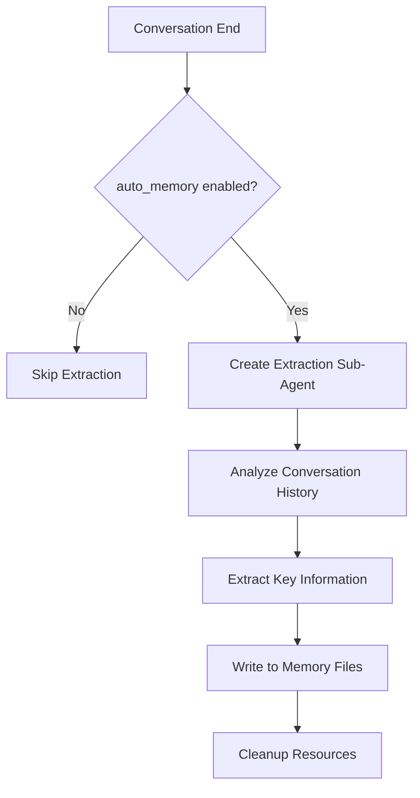

# Auto Memory

Auto Memory is JiuwenSwarm's post-conversation memory extraction feature. After each conversation ends, it automatically analyzes the dialogue content, extracts information worth retaining long-term, and writes it to memory files with project-isolated storage.

---

## Overview

- **Automatic Extraction**: After conversation ends, the system automatically analyzes and extracts key information without user intervention
- **Project Isolation**: Each project stores memory independently, avoiding cross-project information confusion
- **Configurable Toggle**: Flexible enable/disable via config file or TUI command

---

## Enabling

### Config File

The config key is mode-aware:

- **agent mode**: global `auto_memory_enabled` (top-level in `config.yaml`);
- **code mode**: `modes.code.memory.auto_coding_memory` (under the `modes.code.memory` section).

```yaml
# agent mode — global toggle
auto_memory_enabled: true

# code mode — per-mode toggle under modes.code.memory
modes:
  code:
    memory:
      auto_coding_memory: true
```

### TUI Command

Open the tabbed console via `/memory` command in TUI terminal:

```
/memory          # Open memory management tabbed console
/memory toggle   # Switch to toggle tab
```

The tabbed console provides 4 tabs: edit / status / toggle / open, with the **edit** tab selected by default. Interaction keys: ←/→ switch tabs, ↑/↓ move within the list, Enter execute the selected item, Ctrl+O toggle full path (edit/open tabs; resets to relative path when switching tabs), Esc close the console.

---

## Storage Path

Auto Memory stores memories isolated by project path:

```
~/.jiuwenswarm/projects/{sanitized-project-path}/memory/
├── MEMORY.md                    # Long-term memory
├── YYYY-MM-DD.md                # Daily memory
└── consolidated_{hash}.md       # Consolidated memory (optional)
```

Where `{sanitized-project-path}` is the project path after safety processing (special characters replaced with underscores).

---

## How It Works

### Extraction Timing

Auto Memory triggers at the following moments:

1. **Conversation End**: After each user-Agent conversation ends, the system checks if memory extraction is needed
2. **Non-streaming Request**: Triggers after `process_message` returns result
3. **Streaming Request**: Triggers after `process_message_stream` completes

### Extracted Content

The system analyzes conversation content through a sub-Agent, extracting the following types of information:

| Information Type | Description | Example |
|-----------------|-------------|---------|
| User Preferences | Preferences or habits explicitly expressed by user | "User prefers pytest framework" |
| Project Decisions | Technical choices, architecture decisions | "Project adopts FastAPI as backend framework" |
| Key Facts | Facts that need long-term retention | "Database connection string stored in .env file" |
| Problem Solutions | Debugging process, root causes | "Login failure caused by JWT expiry time misconfiguration" |

### Extraction Flow



---

## Configuration

| Config Item | Description | Default Value |
|------------|-------------|---------------|
| `auto_memory_enabled` | Auto memory extraction toggle (agent mode, top-level) | `false` |
| `modes.code.memory.auto_coding_memory` | Auto coding memory extraction toggle (code mode) | `false` |

---

## TUI Interaction

### `/memory` Command

Enter `/memory` command in TUI to open the memory management tabbed console (the **edit** tab is selected by default):

```
Memory
[edit] [status] [toggle] [open]
  ↑
  ←/→ switch tabs | ↑/↓ move list | Enter execute | Ctrl+O toggle full path (edit/open) | Esc close

--- toggle tab ---
Switches adapt to the current mode. Each row shows the key (padded), a ✓ on / ✗ off marker, and a Chinese description (separated by spaces, no ·):

agent mode:
  memory_enabled              ✓ on   记忆功能总开关
  memory_proactive            ✓ on   对话中自动搜索和记录
  memory_forbidden_enabled    ✗ off  过滤敏感信息

code mode:
  memory_enabled              ✓ on   记忆功能总开关
  auto_coding_memory          ✓ on   每轮对话后自动提取记忆（需总开关开启）
  memory_forbidden_enabled    ✗ off  过滤敏感信息
```

The switches in the toggle tab adapt to the current mode (agent mode / code mode). Toggle the corresponding switch to enable/disable the respective memory feature.

---

## Notes

1. **First Enable**: After first enabling auto memory, restart the session for it to take effect
2. **Storage Space**: Long-term use accumulates memory files; recommend periodic cleanup of outdated content
3. **Sensitive Information**: System automatically filters passwords, API keys, etc. (via `memory.forbidden_memory_definition` config)
4. **Performance Impact**: Extraction runs asynchronously in background, does not affect conversation response speed

---

## See Also

- [Configuration](Configuration.md) — Config file details
- [Quick start (TUI)](Quickstart_tui.md) — TUI command usage