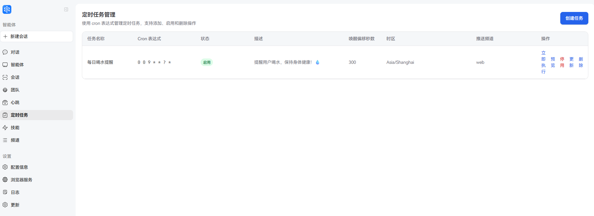
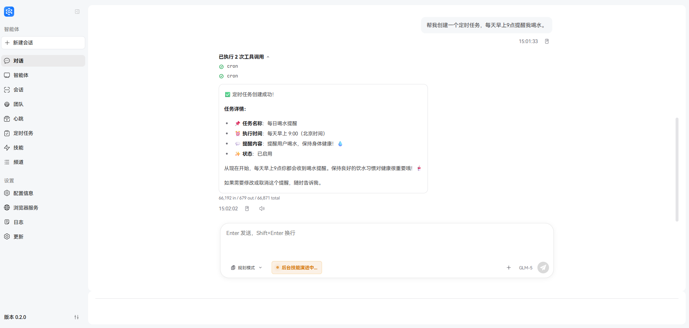
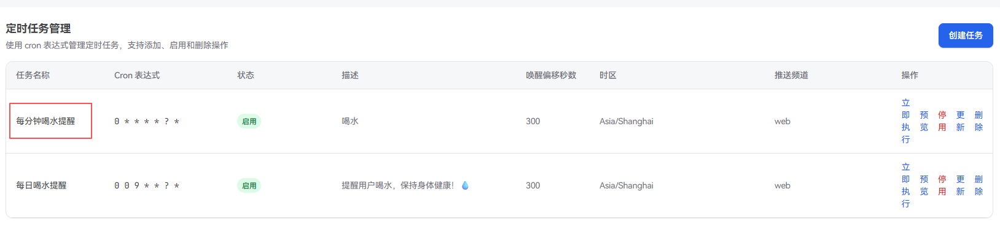
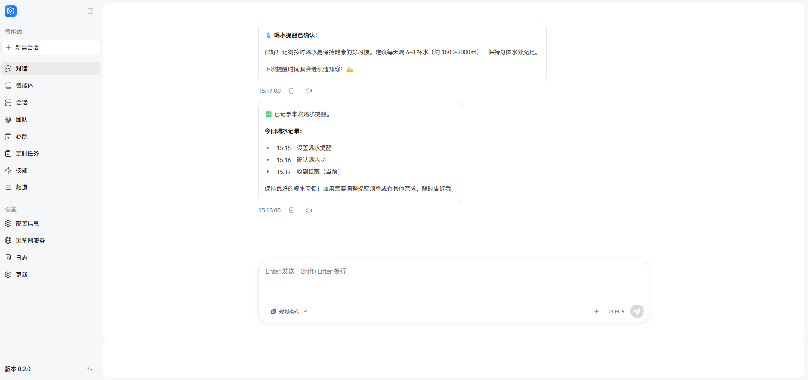
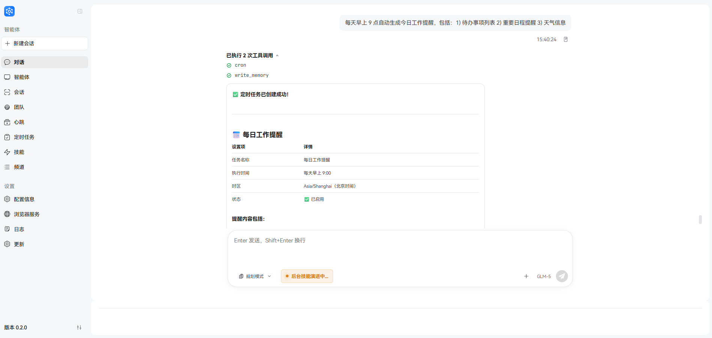
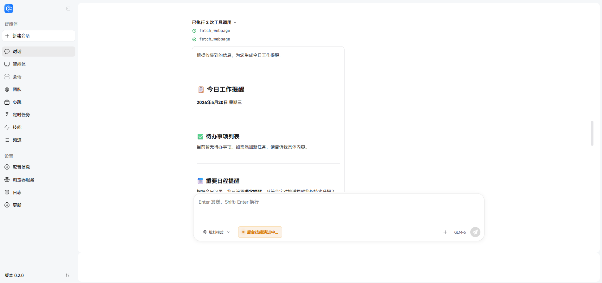

# Scheduled Tasks (Cron)

Scheduled tasks (Cron) are an essential mechanism for automation in JiuwenSwarm.

---

## Concepts

### What are Scheduled Tasks

A **Scheduled Task (Cron Job)** is a mechanism that automatically executes tasks according to a predefined schedule. In JiuwenSwarm, scheduled tasks allow the Agent to automatically perform specific operations at specified times and push results to designated channels.

**Core Capabilities:**

| Capability | Description |
|------------|-------------|
| **Scheduled Execution** | Automatically triggered based on Cron expression |
| **Natural Language Description** | Describe tasks in natural language, Agent understands and executes |
| **Multi-channel Delivery** | Results can be pushed to Web, Feishu, WeChat, etc. |
| **Auto Wake-up** | Wake up Agent in advance to ensure timely execution |
| **Team/SwarmFlow** | Support multi-agent collaboration for complex tasks (see [§6](#6-team-mode-and-swarmflow-multi-agent-scheduled-jobs)) |

**Typical Use Cases:**

- 📅 **Daily Reminders**: Send work reminders, health reminders at fixed times
- 📊 **Periodic Summaries**: Regularly summarize data, generate daily/weekly reports
- 🔄 **Scheduled Checks**: Periodically check system status, monitor task progress
- 📢 **Message Push**: Send messages or notifications to specific channels on schedule
- 🤝 **Collaborative Tasks**: Team mode multi-agent collaboration for complex analysis

### Cron Expression Syntax

Cron expressions are the standard format for defining when scheduled tasks execute.

**Basic Format:**

```
minute hour day month weekday
```

| Field | Range | Description |
|-------|-------|-------------|
| minute | 0-59 | Minute |
| hour | 0-23 | Hour |
| day | 1-31 | Day of month |
| month | 1-12 | Month |
| weekday | 0-6 | Day of week (0=Sunday) |

**Special Characters:**

| Character | Description | Example |
|-----------|-------------|---------|
| `*` | Any value | `* * * * *` = every minute |
| `,` | Multiple values | `0,30 * * * *` = 0th and 30th minute of every hour |
| `-` | Range | `0 9-17 * * *` = every hour from 9am to 5pm |
| `/` | Interval | `*/15 * * * *` = every 15 minutes |

**Common Expression Examples:**

| Expression | Meaning |
|------------|---------|
| `0 9 * * *` | Every day at 9:00 AM |
| `30 18 * * *` | Every day at 6:30 PM |
| `0 9 * * 1` | Every Monday at 9:00 AM |
| `0 9,18 * * *` | Every day at 9:00 AM and 6:00 PM |
| `*/30 * * * *` | Every 30 minutes |
| `0 0 * * *` | Every day at midnight |

### Difference between Cron and Heartbeat

JiuwenSwarm provides two automation mechanisms: **Scheduled Tasks (Cron)** and **Heartbeat**. For detailed comparison, see [Cron vs Heartbeat section in Heartbeat tutorial](Heartbeat.md#difference-between-cron-and-heartbeat).

| Aspect | Scheduled Tasks (Cron) | Heartbeat |
|--------|------------------------|-----------|
| **Trigger Method** | Triggered at fixed time points | Triggered at fixed intervals |
| **Time Definition** | Uses Cron expression (e.g., every day at 9am) | Uses interval duration (e.g., every 5 minutes) |
| **Use Cases** | Tasks with specific time points (reports, reminders, collaborative analysis) | Continuous checks, status monitoring |
| **Configuration** | Configure Cron expression | Configure heartbeat interval |
| **Execution Precision** | Precise to specified time point | Executes at interval cycles |

---

## Quick Start

### Create via Web Interface

**Steps:**

1. Open JiuwenSwarm Web interface, click **"Scheduled Tasks"** in the left navigation
2. Enter the scheduled tasks page, click **"Create"** button (highlighted in red box)
3. Fill in the task configuration form:



| Field | Description | Example |
|-------|-------------|---------|
| **Task Name** | Task name (unique identifier) | `daily_reminder` |
| **Cron Expression** | Cron expression | `0 9 * * *` (every day at 9am) |
| **Status** | Task status | Enable/Disable |
| **Description** | Task content description | Generate today's work reminder |
| **Wake Offset Seconds** | Wake-up advance seconds | `300` (5 minutes advance) |
| **Delivery Channel** | Result delivery channel | `web`, `feishu`, `wechat`, `wecom`, `whatsapp`, `telegram`, etc. |
| **Project Directory** | Project working directory (absolute path) for task归属 | `/home/user/my-project`; defaults to current session's project |

4. Click **"Create"**, the task will take effect automatically

**Project归属:**

The task is automatically assigned to the project matching `project_dir` (falls back to the default project if no visible project matches). You can then manage cron jobs and their execution sessions by project in the project view.

**Storage Location:**

Scheduled task configurations are saved at:
```
~/.jiuwenswarm\agent\home\cron_jobs.json
```

### Create via Chat

When the Agent has the `cron_create_job` tool capability, you can create scheduled tasks directly through natural language conversation.



**Example Conversation:**

```
User: Create a scheduled task to remind me to drink water every morning at 9.
```

The Agent will automatically:
1. Parse time intent → `cron_expr: "0 9 * * *"`
2. Understand task content → `description: "remind to drink water"`
3. Determine delivery channel → `targets: "web"`
4. Call the tool to create the task

> **Tip**: When creating tasks via chat, the Agent automatically infers reasonable defaults based on context, such as timezone and channel.

---

## Scheduled Task Execution

### Execution Process

When a scheduled task triggers at the fixed time, a running conversation will appear on the chat page.

**Execution Flow:**

1. **Trigger Time**: Reaches the time point defined by Cron expression
2. **Agent Wake-up**: Agent is woken up based on `wake_offset_seconds` advance
3. **Task Execution**: Agent starts executing the content described in the task
4. **Result Delivery**: After execution completes, results are pushed to the designated channel

**Execution Status:**

| Status | Description |
|--------|-------------|
| **Pending** | Task created, waiting for trigger time |
| **Running** | Agent is executing the task |
| **Completed** | Task execution finished, results pushed |
| **Failed** | Error occurred during task execution |

### View Execution Results

The execution results of scheduled tasks can be viewed on the chat page.





---

## Scheduled Task Management

After creation, tasks can be managed on the frontend page with the following operations:

| Operation | Description |
|-----------|-------------|
| **Run Now** | Manually trigger the task; returns `{accepted, run_id, session_id}` so you can jump to the execution session |
| **Preview** | View task details (includes `project_id` and `last_session_id`) |
| **Disable** | Pause the task, no longer auto-trigger |
| **Update** | Modify task config (including `project_dir` to reassign project) |
| **Delete** | Delete the task |

### Bidirectional Task–Session Linking

Each cron execution creates a session. The following fields link tasks and sessions in both directions:

| Field | Location | Description |
|-------|----------|-------------|
| `project_id` | CronJob | Project ID the task belongs to |
| `last_session_id` | CronJob | Session ID of the most recent execution (`null` if never run) |
| `cron_id` | SessionInfo | Source cron job ID (empty for regular sessions) |

- Task → session: use `last_session_id` from `cron.job.get`
- Session → task: filter by `cron_id` via `project.get_cron_sessions`
- Project view: `project.get_sessions` (regular) + `project.get_cron_sessions` (cron) are mutually exclusive

---

## Practical Examples

### Daily Work Reminder

**Scenario:** Automatically generate a work reminder every morning at 9 AM and push to the Web interface.

**Configuration Steps:**

1. Create a scheduled task, enter in the chat:
```
Every morning at 9 AM, automatically generate today's work reminder, including: 1) Todo list 2) Important schedule 3) Weather info
```



2. After successful creation, the Agent will automatically execute and push results at 9:00 AM every day

**Data Source Explanation:** Todos, schedules, etc. are read by the Agent from `agent/memory/` memory files (written during daily conversations); weather info is obtained via search tools. Content not in memory typically won't appear in the reminder.

**Execution Result:**



```
📋 Today's Work Reminder (May 20, 2026, Wednesday)

1️⃣ Todo List
Currently no pending todos.

2️⃣ Important Schedule
No important schedule for today.

3️⃣ Weather Info
Today's weather:

- 🌫️ Condition: Cloudy
- 🌡️ Temperature: 16°C ~ 25°C
- 💨 Wind: East wind, light breeze
- 📍 Location: Beijing

Three-day Forecast:

- May 21 (Thu): Cloudy to light rain, 16°C ~ 24°C, south wind light breeze
- May 22 (Fri): Moderate rain to cloudy, 17°C ~ 23°C, south wind light breeze
- May 23 (Sat): Cloudy, 19°C ~ 28°C, southwest wind light breeze

Tips:

- Today is cloudy with moderate temperature, recommend wearing a light jacket
- Rain expected tomorrow and the day after, please prepare rain gear in advance
- Weekend weather will improve, suitable for outdoor activities
- Wish you a productive day! If you have new todos or schedule, feel free to tell me.
```

---

## FAQ

### Q1: What if the scheduled task doesn't execute on time?

**Troubleshooting Steps:**

1. Check if the task is enabled (`enabled: true`)
2. Verify the Cron expression is correct
3. Check if the timezone setting is correct
4. Ensure JiuwenSwarm service is running
5. Check log files for any errors

### Q2: How to modify an existing scheduled task?

In the scheduled task list on the Web interface, click the **"Edit"** button on the right side of the task, modify the configuration and save. The scheduler will automatically update after modification.

### Q3: Are scheduled task results saved?

Scheduled task execution results are:
- Pushed to the designated channel (Web/Feishu, etc.)
- Saved as session history in corresponding session files
- Viewable through session management

### Q4: What does wake_offset_seconds do?

`wake_offset_seconds` defines how early to wake up the Agent. For example:
- Task scheduled for 9:00 AM
- `wake_offset_seconds: 300` (5 minutes)
- Agent starts preparing at 8:55 AM to ensure execution at 9:00 AM sharp

### Q5: Which delivery channels are supported?

Currently supported channels:
- `web` - Web interface
- `feishu` - Feishu
- `wechat` - WeChat
- `wecom` - WeCom (Enterprise WeChat)
- `whatsapp` - WhatsApp
- `telegram` - Telegram

---

## 6. Team mode and SwarmFlow (multi-agent scheduled jobs)

Besides the default single-agent path, cron jobs now support **Team mode**: at wake time the gateway starts multi-agent collaboration and may run a **SwarmFlow** workflow (see [Agent Team](AgentTeam.md) and [TUI SwarmFlow Guide](TUISwarmFlowGuide.md)).

#### 6.1 Supported execution modes (`mode`)

| `mode` | Description |
|---|---|
| `agent.fast` | **Default**. Single agent, fast path; good for reminders and simple queries |
| `agent` / `agent.plan` / `plan` | Single agent with planning or deeper reasoning |
| `team` | Multi-agent team; may use SwarmFlow |
| `team.plan` | Team with planning-oriented collaboration |
| `code.team` | Code-oriented team collaboration |

When creating jobs from TUI/Web, pass `mode=`. The UI loads supported modes and default timeouts via `cron.job.meta`.

#### 6.2 Examples

```text
# Weekly team report pushed to TUI
/cron add name=model-weekly cron_expr="0 9 * * 1" description="Compare GLM vs DeepSeek and output a Markdown report" mode=team targets=tui

# Simple reminder with default agent.fast
/cron add name=water cron_expr="0 30 8 * * *" description="Remind me to drink water" targets=tui
```

Optional **`timeout_seconds`** (60–259200) overrides the per-run timeout:

| Mode | Default timeout |
|---|---|
| Normal modes (e.g. `agent.fast`) | 600 s (10 min) |
| `team` / `team.plan` / `code.team` | 1200 s (20 min) |

```text
/cron add name=long-report cron_expr="0 9 * * 1" description="..." mode=team timeout_seconds=3600 targets=tui
```

#### 6.3 Execution and delivery (vs single-agent jobs)

**Execution path**

- Non-team jobs: unary Agent call on channel `__cron__`, session `cron_{timestamp}_{job_id}`.
- Team jobs: **streaming** AgentServer call with `mode=team`, same isolated session `cron_{timestamp}_{job_id}` — **not** the creator TUI `session_id`.

**Why an isolated session**

- `session_id` on the job is still stored (mainly for IM routing on Feishu and similar channels).
- Team runs use `cron_*` so closing the creator TUI does not trigger `cancel_agent_sessions_on_disconnect` against an in-flight team cron stream.
- **Trade-off**: SwarmFlow / team progress is **not** shown live in the creator TUI window during the run (events use the `cron_*` session).

**Result push**

All `targets` channels (`web`, `tui`, Feishu, DingTalk, WeCom, etc.) share the same `_push_to_targets` delivery path and body formatting:

| Scenario | Push body format |
|---|---|
| **Successful completion** | `{agent output}` (no job-name prefix, no `[cron]` prefix) |
| **Failure / timeout / no valid report** | Status text starting with `[cron]` (e.g. `[cron] job execution failed: …`), not wrapped with a job-name prefix |
| **In-progress placeholder** | `{job name} 正在执行中，结果稍后补发（push_at=…）` |

Channel differences are mainly **routing**, not body format:

- **`web`**: delivered to the Web chat panel; placeholders can be replaced by final results via `payload.cron.is_placeholder` and `run_id`.
- **`tui`**: intentionally omits `session_id`; Gateway **broadcasts** to every connected TUI window. Broadcast may be missed if no TUI is online at completion time.
- **Feishu / DingTalk / WeCom and other IM channels**: route via the job's bound `session_id` and `metadata`; group-created jobs may use IMOutboundPipeline routing.

Keep the gateway running, or inspect jobs via `/cron show` or the Web Cron panel.

**Team completion detection**

Gateway and AgentServer share `jiuwenswarm/common/cron_team_completion.py` so runs do not end early when:

- A leader interim reply or placeholder text appears before the real report;
- Harness delegation still has open `team.task` entries or busy members;
- SwarmFlow has not reached `completed` while the leader already emitted an interim `chat.final`.

Structured signals (workflow completed + leader final, or harness leader final with no open tasks) gate stream end and `result_text`.

#### 6.4 Implementation map (developers)

| Module | Role |
|---|---|
| `gateway/cron/scheduler.py` | Wake/push scheduling; team stream consume/timeout; broadcast formatting |
| `gateway/cron/models.py` | `mode` / `timeout_seconds` validation and defaults |
| `common/cron_team_completion.py` | Shared team-round completion state machine |
| `server/runtime/agent_adapter/team_helpers.py` | Cron team streams and early finish of background tasks |
| `channels/tui/.../cron.ts` | `/cron` subcommands and `mode` / `timeout_seconds` |

See also [Slash commands — `/cron`](SlashCommands.md#cron-scheduled-task-management).

---

## Related Links

- [Heartbeat](Heartbeat.md) - Learn about the difference between heartbeat and scheduled tasks
- [Channels](Channels.md) - Configure message delivery channels
- [Task Planning](TaskPlanning.md) - Learn about task management
- [Agent Tutorial](Agent.md) - Learn about conversation features

---

*Document Version: v1.0*  
*Target Audience: JiuwenClaw Users*  
*Last Updated: 2026-05-05*
