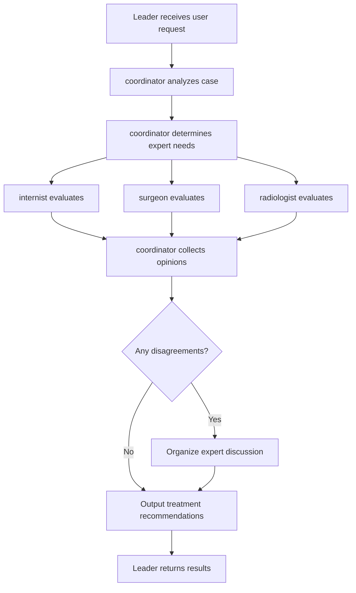
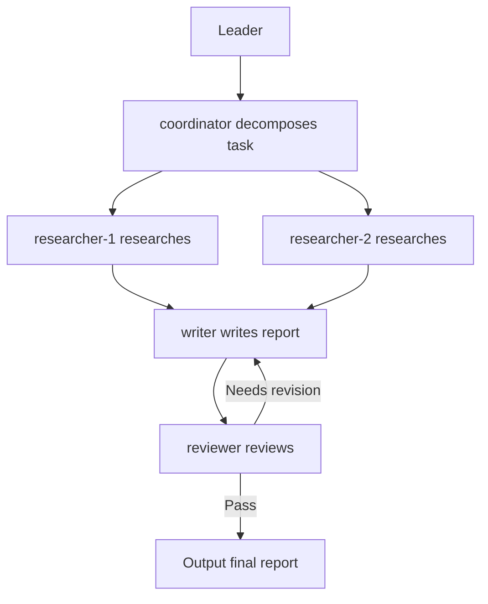

# Team Skills

JiuwenClaw's **Team Skills** is a standardized capability package designed for multi-Agent collaboration. It is not a capability patch for a single Agent — rather, it captures a proven team collaboration workflow as a reusable, replicable, and evolvable team collaboration SOP, so that complex tasks no longer need to be improvised from scratch every time.

---

## 1. Concept Overview

### 1.1 What Are Team Skills?

Team Skills occupy the **multi-Agent collaboration layer** in JiuwenClaw's skill system. If an Agent Skill answers "how a single Agent does things," then a Team Skill answers "how a team of Agents works together."

In traditional AI Agent usage, when facing complex tasks, users often need to manually orchestrate how multiple Agents collaborate — who does what, who goes first, what happens when something goes wrong. This approach requires starting from scratch every time, produces inconsistent collaboration quality, and makes workflows hard to reuse. Team Skills exist precisely to solve this pain point:

- **Capture once, reuse repeatedly**: Encapsulate proven team collaboration workflows as standardized capability packages. When encountering similar tasks next time, simply invoke the skill — no need to re-orchestrate.
- **Evolvable workflows**: Collaboration workflows are not static. They can be continuously optimized and iterated based on real-world usage feedback.
- **Predictable quality**: Pre-defined role assignments, collaboration sequences, and exception handling strategies make output quality more consistent across runs.

### 1.2 Team Skills vs. Agent Skills

| Dimension | Agent Skill | Team Skill |
|-----------|-------------|------------|
| **Positioning** | Capability extension for a single Agent | Collaboration pattern encapsulation for a multi-Agent team |
| **Focus** | How a single Agent does things | How a team of Agents works together |
| **Structure** | Single `SKILL.md` file | Directory structure (SKILL.md + roles + workflow + bind + dependencies) |
| **Use cases** | Single tasks that one Agent can complete | Complex tasks requiring multi-role collaboration and workflow reuse |
| **Collaboration** | No collaboration — Agent executes independently | Pre-defined role assignments, collaboration workflow, and exception handling |
| **Reusability** | Capability is reusable | Collaboration workflow is reusable |

Simple analogy: An Agent Skill is like giving one person a professional skill (e.g., "can do data analysis"), while a Team Skill is like establishing a collaboration SOP for a team (e.g., "how a research team goes from investigation to writing to review to produce a report").

### 1.3 Cross-Framework Portability

Team Skills are not limited to the JiuwenClaw platform. Their core design philosophy — role assignments, collaboration workflows, boundary constraints — represents a universal way to encapsulate team collaboration capabilities, adaptable to other AI Agent frameworks that support similar collaboration standards. This means:

- A Team Skill created in JiuwenClaw can, in principle, be migrated to other platforms supporting similar collaboration standards.
- The standardized 5-file structure provides a foundation for cross-framework interoperability.
- Community-contributed Team Skills can be shared across different platforms, building a shared team skill ecosystem together.

---

## 2. Structure

A Team Skill is fundamentally a **structured directory**, not a single documentation file. This design allows each element of team collaboration — roles, workflows, boundaries, dependencies — to be clearly organized and maintained.

### 2.1 Directory Structure Overview

```
team-skill-name/
├── SKILL.md              # Team skill entry file
├── roles/                # Role definitions directory
│   ├── coordinator.md    # Coordinator role
│   ├── researcher.md     # Researcher role
│   └── writer.md         # Writer role
├── workflow.md           # Collaboration workflow definition
├── bind.md               # Boundary and exception handling rules
├── dependencies.yaml     # External dependency declarations
├── examples/             # Optional: examples and templates
│   └── sample-case.md
├── templates/            # Optional: output templates
│   └── report-template.md
└── assets/               # Optional: resource files
    └── diagrams/
```

### 2.2 Key Files

| File | Purpose | Required |
|------|---------|----------|
| `SKILL.md` | Team skill entry file; defines metadata such as skill name, description, applicable scenarios, role list, and file index | Yes |
| `roles/*.md` | Role definition files; each file describes one Agent role's responsibilities, capabilities, and behavioral norms | Yes |
| `workflow.md` | Collaboration workflow definition; describes interaction sequences, task flows, and decision nodes between roles (includes mermaid flowchart) | Yes |
| `bind.md` | Boundary and exception handling rules; defines resource constraints, behavioral constraints, and failure handling strategies | Yes |
| `dependencies.yaml` | External dependency declarations; lists tools, other skills, etc. required for the skill to run | Yes |

### 2.3 Core File Details

#### SKILL.md — Team Entry Point

`SKILL.md` is the Team Skill's entry file, using YAML frontmatter to declare metadata:

```markdown
---
name: medical-consultation-team
version: 1.0.0
author: jiuwenclaw-team
description: |
  Multi-disciplinary medical expert consultation team skill, organizing specialists for parallel evaluation and opinion integration via a coordinator.
  Use when multiple specialist experts need to jointly evaluate a complex case and output structured treatment recommendations.
  Do NOT use for simple cases that a single specialty can independently judge.
kind: team-skill
roles:
  - id: coordinator
    purpose: Organize experts, consolidate opinions, output treatment recommendations
    skills: []
    tools: []
  - id: internist
    purpose: Evaluate cases from an internal medicine perspective
    skills: []
    tools: []
  - id: surgeon
    purpose: Evaluate cases from a surgical perspective
    skills: []
    tools: []
  - id: radiologist
    purpose: Analyze cases from a radiology perspective
    skills: []
    tools: []
---

# Medical Consultation Team Skill

This team skill uses a specialization pipeline pattern (Pattern C) to organize multi-disciplinary medical experts for case consultation, solving the convergence bias problem that arises when a single Agent role-plays multiple perspectives.

## Workflow

0. **Pre-flight: check dependencies** — read [dependencies.yaml](dependencies.yaml) and verify. Report missing items: `required: true` = likely fails without it; `required: false` = degraded but functional. **User decides** whether to proceed.
1. **coordinator receives case** — Analyze the case, determine expert needs, create consultation task.
2. **Experts evaluate in parallel** — internist / surgeon / radiologist independently evaluate and submit specialist opinions.
3. **coordinator integrates opinions** — Collect all expert opinions, identify disagreements, organize discussion if disagreements exist.
4. **Output treatment recommendation report** — coordinator integrates final opinions, outputs structured report.

## Roles

| id | Purpose | When dispatched | Input | Key dependencies | Role file |
|---|---------|----------------|-------|-----------------|-----------|
| coordinator | Organize experts, consolidate opinions | Every run | User-submitted case | — | [roles/coordinator.md](roles/coordinator.md) |
| internist | Evaluate from internal medicine perspective | Every run (parallel) | Distributed case materials | — | [roles/internist.md](roles/internist.md) |
| surgeon | Evaluate from surgical perspective | Every run (parallel) | Distributed case materials | — | [roles/surgeon.md](roles/surgeon.md) |
| radiologist | Analyze from radiology perspective | Every run (parallel) | Distributed case materials | — | [roles/radiologist.md](roles/radiologist.md) |

> Before dispatching each teammate, read the corresponding role file and extract the `## Inline Persona for Teammate` section — paste it directly into the dispatch prompt.

## Files

| File | What it contains | When to read |
|------|------------------|-------------|
| [workflow.md](workflow.md) | Mermaid flowchart, step-by-step protocol, integration rules, Final Report format | Before first dispatch — the complete playbook |
| [bind.md](bind.md) | Resource limits, behavioral constraints, failure handling and degraded modes | When hitting limits, handling failures, or needing degraded-mode rules |
| [roles/*.md](roles/) | Per-role identity, success criteria, output schema, Inline Persona for Teammate | Before dispatching each teammate — extract Inline Persona |
| [dependencies.yaml](dependencies.yaml) | External skills and tools required to run | **Startup** — verify deps, report missing items, user decides go/no-go |
```

**Key field descriptions**:

- **`name`**: Unique skill identifier; must match the directory name (kebab-case, conventionally ending with `-team`).
- **`kind`**: Must be `team-skill` (note: not `type`), distinguishing Team Skills from regular Agent Skills.
- **`roles`**: Role list; **at least 2 roles required**, each role must include `id` (role identifier), `purpose` (one-line responsibility description, ≤150 characters), `skills` (dependent skill list), and `tools` (dependent tool list).
- **`description`**: Skill description following conciseness principles (≤4 lines, ≤500 characters), using WHAT / WHEN / NOT three-line structure.

#### roles/*.md — Role Definitions

Each role file defines one Agent's responsibilities and behavior, containing 5 mandatory sections:

1. **`## Identity`**: Role identity definition. The first line must be a 1-line motto, e.g., `> *"I am trying to break this code in production."*` — this is the most important anti-convergence mechanism.
2. **`## Success Criteria`**: Success criteria; lists the goals the role needs to achieve.
3. **`## Boundary`**: Boundary definition; must include `**Forbidden**` (things the role must not do, preventing role overlap) and `**Mandatory**` (things the role must do, preventing laziness).
4. **`## Output Schema`**: Output format; defines the structure of the role's deliverables.
5. **`## Inline Persona for Teammate`**: Inline persona prompt; a complete pasteable prompt for the Leader to inject when dispatching tasks.

Example:

```markdown
---
role_name: coordinator
description: Consultation coordinator, responsible for organizing experts and consolidating opinions
---

# Coordinator Role

## Identity

> *"I ensure every expert's voice is heard, and the final recommendation is consensus, not compromise."*

The coordinator drives the consultation process. They do not provide medical opinions directly but ensure all expert opinions are fully expressed and integrated.

## Success Criteria

- All invited experts have submitted their specialist opinions
- Areas of disagreement have been identified and discussed
- The final treatment recommendation is structured and actionable

**Focus areas**: Opinion integration quality, process completeness

## Boundary

**Forbidden**:
- Providing direct medical diagnostic opinions
- Making professional judgments on behalf of experts
- Concealing disagreements between experts

**Mandatory**:
- Ensuring every expert receives complete case materials
- Noting areas of disagreement and how they were handled in the report
- Outputting structured treatment recommendations

## Output Schema

```markdown
# Consultation Report
## Patient Information
## Expert Opinion Summary
### [Expert 1] Opinion
### [Expert 2] Opinion
## Comprehensive Treatment Recommendations
## Urgency Level
```

## Inline Persona for Teammate

You are a consultation coordinator. Your responsibilities are:
1. Receive and analyze case information
2. Determine which types of experts are needed
3. Distribute case materials to each expert
4. Collect and consolidate expert opinions
5. Identify areas of disagreement and organize discussion
6. Output a structured treatment recommendation report

You do not provide direct medical diagnostic opinions; you ensure all expert opinions are fully expressed and integrated.
```

#### workflow.md — Collaboration Workflow

Defines interaction sequences and task flows between roles, containing 3 mandatory sections:

1. **`## Overview`**: Workflow overview; must include a mermaid flowchart — this is the core expressive difference between Team Skills and single-Agent Skills.
2. **`## Detailed Steps`**: Detailed steps; each step includes executor, input, output, serial/parallel designation, and quality gate.
3. **`## Acceptance Criteria`**: Acceptance criteria; standards for judging whether a collaboration run was successful.

Example:

```markdown
# Consultation Collaboration Workflow

## Overview



## Detailed Steps

### Step 1: Case Reception and Analysis
- **Executor**: coordinator
- **Input**: Case information submitted by user
- **Output**: Expert needs list + consultation task
- **Mode**: Serial
- **Quality gate**: If case information is insufficient, request supplementary information from user

### Step 2: Expert Evaluation
- **Executor**: internist / surgeon / radiologist (parallel)
- **Input**: Distributed case materials
- **Output**: Specialist opinions from each expert
- **Mode**: Parallel
- **Quality gate**: If an expert times out without responding, skip and note missing opinion in report

### Step 3: Opinion Integration
- **Executor**: coordinator
- **Input**: Expert opinions
- **Output**: Integrated opinions + disagreement identification
- **Mode**: Serial
- **Quality gate**: If serious disagreements exist, organize expert discussion

### Step 4: Output Results
- **Executor**: coordinator → Leader
- **Input**: Integrated opinions
- **Output**: Structured treatment recommendation report
- **Mode**: Serial
- **Quality gate**: Report must include all expert opinions and disagreement handling notes

## Acceptance Criteria

- All invited experts have submitted opinions (or missing opinions are noted)
- Areas of disagreement have been identified and handled
- The final report is structured and includes comprehensive treatment recommendations
```

#### bind.md — Boundary and Exception Handling

Defines collaboration constraints and exception handling strategies, containing 3 mandatory sections:

1. **`## Resource Constraints`**: Resource constraints; must include at least `max_parallel_teammates`, `total_wall_clock_budget`, `total_token_budget`.
2. **`## Behavioral Constraints`**: Behavioral constraints; team-level rules (e.g., Leader does not write content, teammates cannot see each other's output, etc.).
3. **`## Failure Handling`**: Failure handling; covers teammate failure (timeout, malformed output) and input-overscale degradation strategies.

Example:

```markdown
# Boundary and Exception Handling

## Resource Constraints

| Constraint | Value |
|------------|-------|
| max_parallel_teammates | 5 |
| total_wall_clock_budget | 30 minutes |
| total_token_budget | 50000 |

## Behavioral Constraints

- Leader does not write medical content directly; only responsible for scheduling and integration
- Experts cannot see each other's raw opinions (isolated evaluation)
- coordinator must note all areas of disagreement in the report
- Maximum 5 experts per consultation session

## Failure Handling

### Expert Unavailable
- **Strategy**: Skip the expert and note missing opinion in the report
- **Degradation**: If a critical expert is unavailable, prompt user to reschedule

### Serious Opinion Disagreement
- **Strategy**: Organize expert discussion and record each party's reasoning
- **Output**: Present different approaches and their supporting evidence in the report

### Insufficient Information
- **Strategy**: Request supplementary information from the user
- **Timeout**: If user does not respond, provide conservative recommendations based on available information

### Input Overscale
- **Strategy**: When case materials exceed 2000 characters, coordinator first summarizes before distributing to experts
```

#### dependencies.yaml — External Dependencies

Declares external resources required for the skill to run. Must include both `skills` and `tools` segments (even if empty, explicitly write `[]`):

```yaml
skills:
  - name: web-research
    source: local
    required: false
    purpose: Assist experts in searching latest medical literature
  - name: report-generator
    source: local
    required: true
    purpose: Generate structured treatment recommendation reports

tools:
  - name: readFile
    required: true
    purpose: Read case material files
  - name: writeFile
    required: true
    purpose: Output treatment recommendation reports
```

**Field Descriptions**:

| Field | Segment | Required | Description | Example Values |
|-------|---------|----------|-------------|----------------|
| `name` | skills, tools | Yes | Skill/tool name | `web-research`, `readFile` |
| `source` | skills | Yes | Skill source | `local` (local), `hub` (skill center) |
| `required` | skills, tools | Yes | Whether required | `true` (required), `false` (optional) |
| `purpose` | skills, tools | Yes | Purpose description (≤150 chars) | `Assist experts in searching latest medical literature` |

> **Note**: Even when there are no dependencies, you must explicitly write `skills: []` and `tools: []` (an empty list signals "checked, confirmed no dependency of this type" — different from omitting the segment, which is a spec violation).

---

## 3. Usage Guide

### 3.1 Getting Started with Team Skills

Users typically begin using Team Skills through the following steps:

**Step 1: Acquire a Team Skill from Team Skills Hub**

1. Open JiuwenClaw's "Skills" panel
2. Click "Team Skills Hub Online Search"
3. Enter keywords to search for the team skill you need (e.g., "medical consultation", "research report")
4. Click "Install" to add the skill to your workspace

You can also search and install via command line:

```
# Search Team Skills
/teamskills search "medical consultation"

# View Team Skill details
/teamskills info <asset_id> --version 1.0.0

# Install a Team Skill
/teamskills install <asset_id> --version 1.0.0
```

> **Tip**: `<asset_id>` is the unique skill identifier on Team Skills Hub (e.g., `sk-123`), shown in search results.

**Step 2: Use in JiuwenClaw**

After installation, the Team Skill automatically appears in the available skills list:

1. Describe your task objective in the conversation
2. The system recognizes and invokes the appropriate Team Skill
3. The team collaboration workflow runs automatically according to the predefined process
4. Receive structured output results

### 3.2 When to Use Team Skills

Team Skills are particularly suited for the following scenarios:

| Scenario Characteristic | Description | Example |
|-------------------------|-------------|---------|
| Long task chains | Complex tasks requiring multiple steps and stages | From research to writing to review to produce a research report |
| Clear role division | Tasks decomposable into sub-tasks across different professional domains | Multi-disciplinary medical consultation requiring internal medicine, surgery, and radiology experts |
| Desire to reuse proven workflows | Don't want to redesign collaboration every time | Regularly executed code reviews, security audits |
| Structured output needed | Need standardized reports, proposals, or recommendations | Treatment recommendation reports, research reports, audit reports |

**Comparison: When to use Agent Skill vs. Team Skill**

| Situation | Recommended Choice | Reason |
|-----------|-------------------|--------|
| Single task, one Agent can complete | Agent Skill | No multi-role collaboration needed; Team Skill adds unnecessary overhead |
| Multi-step reasoning needed, but no role division | Agent Skill + workflow | The process can be executed step-by-step by a single Agent |
| Multiple professional roles need to collaborate | **Team Skill** | Different roles' professional perspectives are irreplaceable |
| Fixed task workflow, needs reuse | **Team Skill** | Predefined workflows can be reused; quality is more stable |
| Adversarial checking needed (e.g., code review) | **Team Skill** | Single Agent role-playing multiple perspectives tends to produce convergence bias |

### 3.3 Key Usage Principles

The core value of Team Skills lies in: **choosing the right Team Skill and letting the team collaboration workflow run automatically**, rather than manually orchestrating each Agent.

Three key principles when using Team Skills:

1. **Choose the right Team Skill**: Select a team skill that matches your task characteristics. If existing skills don't perfectly match, you can modify an existing skill or create a new one using `teamskill-creator`.
2. **Provide clear input**: Provide complete task information as required by the skill. Clearer input leads to higher collaboration output quality.
3. **Understand the output structure**: Know the skill's output format for easier downstream processing and usage.

Three advantages of Team Skills over ad-hoc team assembly:

| Advantage | Ad-hoc Assembly | Team Skill |
|-----------|----------------|------------|
| Role assignment rules | Need to reassign every time; may miss or confuse | Pre-defined, stable and reliable |
| Collaboration sequence | May miss critical steps | workflow.md explicitly defines the sequence |
| Exception handling | Ad-hoc decisions, inconsistent | bind.md provides unified strategies |

### 3.4 Cross-Framework Reuse Potential

Team Skills use a standardized structure definition (5-file specification) with cross-framework reuse potential:

- Collaboration standards are based on a universal role-workflow-boundary model, not dependent on specific framework implementation details
- Adaptable to other AI Agent platforms supporting similar collaboration standards
- Facilitates migration and sharing of team collaboration experience across different frameworks
- Team Skills Hub serves as a community sharing platform, promoting cross-framework skill ecosystem development

---

## 4. Case Study

### 4.1 Case: Multi-Disciplinary Medical Expert Consultation

This case demonstrates the practical value of Team Skills in a medical consultation scenario.

#### Applicable Scenario

- Patient condition is complex, involving multiple systems
- Different specialist experts need to jointly evaluate
- Desire for comprehensive, structured treatment recommendations

#### User Input

```
Patient information:
- Male, 65 years old
- Chief complaint: Chest pain with difficulty breathing for 2 days
- Past medical history: Hypertension, diabetes
- Test results: ECG ST-segment elevation, elevated D-dimer

Please organize an expert consultation and provide treatment recommendations.
```

#### Team Collaboration Process

**Phase 1: Case Reception and Analysis**

```
[coordinator] Receives case information
[coordinator] Analysis: Chest pain + ECG abnormality + elevated D-dimer → involves cardiovascular and respiratory systems
[coordinator] Determines needed experts: Cardiology, Respiratory, Radiology
[coordinator] Creates consultation task #2024-001
```

**Phase 2: Expert Evaluation (Parallel)**

```
[cardiologist] Cardiovascular evaluation:
- ST-segment elevation suggests possible myocardial injury
- Recommendation: Complete cardiac enzyme panel, cardiac ultrasound
- Preliminary opinion: Rule out acute coronary syndrome

[respiratory] Respiratory system evaluation:
- Elevated D-dimer + difficulty breathing
- Recommendation: Complete pulmonary artery CTA
- Preliminary opinion: Rule out pulmonary embolism

[radiologist] Imaging analysis:
- Recommendation: Chest CT plain + enhanced scan
- Focus on pulmonary artery, coronary artery conditions
```

**Phase 3: Opinion Integration**

```
[coordinator] Collects expert opinions
[coordinator] Identifies key disagreement: Cardiogenic vs. Pulmonary origin
[coordinator] Organizes expert discussion
[Expert consensus]: Prioritize ruling out life-threatening conditions
                    Recommend simultaneous cardiac and pulmonary vascular assessment
```

**Phase 4: Output Results**

```markdown
# Consultation Report #2024-001

## Patient Information
- Male, 65 years old, chest pain with difficulty breathing for 2 days

## Expert Opinion Summary

### Cardiology Opinion
- ST-segment elevation suggests myocardial injury; need to rule out acute coronary syndrome
- Recommended tests: Cardiac enzyme panel, cardiac ultrasound, coronary CTA

### Respiratory Opinion
- Elevated D-dimer requires vigilance for pulmonary embolism
- Recommended tests: Pulmonary artery CTA, blood gas analysis

### Radiology Opinion
- Recommend chest CT enhanced scan for one-stop assessment

## Comprehensive Treatment Recommendations
1. Immediately complete cardiac enzyme panel and blood gas analysis (emergency completion)
2. Perform chest CT enhanced scan, simultaneously assessing coronary and pulmonary arteries
3. ECG monitoring, monitor vital signs
4. Determine next-step treatment plan based on test results

## Urgency Level
⚠️ High risk - Requires immediate attention

---
Consultation time: 2024-01-15 14:30
Participating experts: Cardiology Dr. Zhang, Respiratory Dr. Li, Radiology Dr. Wang
```

#### Team Skills Advantage Demonstration

| Advantage | Ad-hoc Assembly | Team Skill |
|-----------|----------------|------------|
| Role assignment | Need to reassign who evaluates what every time | Pre-defined roles (cardiology/respiratory/radiology), stable and reliable |
| Collaboration sequence | May miss steps (e.g., forgetting to integrate disagreements) | workflow.md explicitly defines: analyze → evaluate → integrate → output |
| Exception handling | What if an expert times out? Ad-hoc decision | bind.md unified strategy: skip and note missing opinion |
| Output format | Different format every time | Structured, standardized report |
| Reusability | Next consultation starts from scratch again | Same Team Skill can be reused |

### 4.2 Case: Research and PPT Writing Team

This case demonstrates Team Skills in a content production scenario.

#### Applicable Scenario

- Complete pipeline from research investigation to PPT writing
- Research and writing require different professional capabilities
- Desire for structured presentation output

#### User Input

```
Please help me complete a research report PPT on "2024 AI Industry Trends",
including market data, technology trends, and future outlook.
```

#### Team Collaboration Process

**Phase 1: Task Decomposition**

```
[coordinator] Receives research topic: "2024 AI Industry Trends"
[coordinator] Decomposes research questions: market data, technology trends, future outlook
[coordinator] Assigns research tasks to researchers
```

**Phase 2: Parallel Research**

```
[researcher-1] Researches market data: market size, growth rate, major players
[researcher-2] Researches technology trends: large models, multimodal, Agent-based
[researcher-3] Researches future outlook: regulatory trends, application prospects, challenges
```

**Phase 3: Report Writing**

```
[writer] Integrates all research findings
[writer] Writes PPT content: slide titles, key points, data chart suggestions
```

**Phase 4: Review and Revision**

```
[reviewer] Reviews report: logical coherence, data accuracy, expression clarity
[writer] Revises based on review feedback
[coordinator] Outputs final PPT content
```

---

## 5. Creation Guide

### 5.1 Creating New Team Skills with teamskill-creator

JiuwenClaw provides the `teamskill-creator` skill to help users create, convert, or modify Team Skills. It includes standardized templates, decision trees, and an automated validator to ensure created Team Skills comply with the specification.

**Getting and Installing**:

`teamskill-creator` is a built-in skill in JiuwenClaw and requires no additional installation. If the skill is not available in your environment, you can obtain it through:

```bash
# Search and install from skill center
/skills search teamskill-creator
/skills install teamskill-creator
```

**Three modes**:

| Mode | Use Case | Output |
|------|----------|--------|
| **CREATE** | Create a new team skill from scratch | New `<teamskill-name>/` directory with the complete 5-file set |
| **CONVERT** | Convert an existing single-Agent Skill to a Team Skill | Transformed `<teamskill-name>/` directory + delta report |
| **MODIFY** | Modify an existing Team Skill (add/remove roles, adjust workflow, etc.) | Updated files |

#### Creation Workflow Example

The following demonstrates creating a "Research and Report Writing Team" as a complete creation process:

**Step 1: Determine if a Team Skill is needed**

First confirm: does this task truly require multi-role collaboration? A Team Skill is only worth creating when at least one of these applies:

1. **Adversarial blind spot**: A single Agent role-playing multiple perspectives produces converging outputs (e.g., code review, security audit)
2. **Parallel decomposition gain**: Multiple independent sub-tasks can run concurrently, and integration is non-trivial (e.g., multi-angle research)
3. **Specialization pipeline with hard handoffs**: Sequential stages with quality gates where blurring boundaries causes regressions (e.g., marketing copy: brief → draft → edit → audit)

If none apply → recommend using a single-Agent Skill instead.

**Step 2: Select collaboration pattern**

Choose a collaboration pattern based on task characteristics:

| Pattern | Use Case | Role Count | Inter-role Visibility |
|---------|----------|------------|----------------------|
| A. Adversarial / Cross-check | Blind spot problems | 2-4 | Not visible (isolation is the value) |
| B. Parallel decomposition | Independent sub-tasks | 2-N | Not visible until integration |
| C. Specialization pipeline | Sequential expert stages | 3-5 | Each stage sees prior stage output |
| Mixed | Multiple justifications stack | 4-6 | Pattern-by-stage |

The Research and Report Writing Team fits **C. Specialization pipeline** pattern (research → writing → review, sequential stages with quality gates).

**Step 3: Design roles**

Write `roles/<id>.md` files for each role, containing 5 mandatory sections:

```
research-report-team/
├── roles/
│   ├── coordinator.md    # Coordinator: decompose tasks, integrate results
│   ├── researcher.md     # Researcher: independent research, submit findings
│   ├── writer.md         # Writer: integrate research, write report
│   └── reviewer.md       # Reviewer: review report, suggest modifications
```

**Anti-overlap test**: Write each role's 1-line motto, then ask "could one role's deliverable substitute for another's?" If yes, boundaries are blurred — redesign before proceeding.

**Step 4: Write collaboration workflow**

Write `workflow.md` with mermaid flowchart, detailed steps, and acceptance criteria:

```markdown
## Overview


```

**Step 5: Write boundary and exception handling**

Write `bind.md` defining resource constraints, behavioral constraints, and failure handling:

```markdown
## Resource Constraints

| Constraint | Value |
|------------|-------|
| max_parallel_teammates | 3 |
| total_wall_clock_budget | 45 minutes |
| total_token_budget | 80000 |

## Behavioral Constraints

- Leader does not write content directly; only responsible for scheduling
- Researchers cannot see each other's research process (ensures independence)
- Writer must integrate all research findings without omission
- Maximum 2 review rounds

## Failure Handling

### Insufficient Research Information
- Strategy: Request additional research directions from user
- Timeout: Provide conservative conclusions based on available research

### Review Opinion Disagreement
- Strategy: Coordinator arbitrates, choosing the more reasonable revision direction
```

**Step 6: Write dependency declarations and entry file**

Write `dependencies.yaml` and `SKILL.md`, referencing content produced in previous steps.

**Step 7: Validate**

Run the automated validator to ensure the Team Skill complies with the specification:

```bash
# Method 1: Use TUI built-in command (recommended)
/teamskills validate path/to/research-report-team/ --type teamskills

# Method 2: Use standalone validation script
python scripts/validate_teamskill.py path/to/research-report-team/
```

The validator checks:
- All 5 files are present
- Frontmatter required fields are complete (`name`, `kind`, `roles`)
- `roles` has at least 2 entries, each with `id` and `purpose`, `id` must not repeat
- Role file names match `roles[].id`
- Each role file contains 5 mandatory sections
- workflow.md contains a mermaid diagram
- bind.md contains 3 mandatory sections
- dependencies.yaml contains `skills` and `tools` segments
- Skills/tools declared in SKILL.md appear in dependencies.yaml

**Exit code 0 = compliant**. Non-zero exit codes print specific failing checks.

### 5.2 Modifying an Existing Team Skill

Use `teamskill-creator`'s MODIFY mode to modify existing Team Skills:

| Change Type | Stages to Re-run | Files to Update |
|-------------|-----------------|----------------|
| Edit role Identity / Boundary / Schema | Stage 2 (affected role only) | `roles/<id>.md` |
| Add or remove a role | Stage 1a + 2 + 3 + 4 + 5 | All 5 files |
| Change workflow steps / topology | Stage 3 | `workflow.md` + `bind.md` (if constraints change) |
| Change bind constraints | Stage 4 | `bind.md` |
| Change dependencies | Stage 2 (auto-match) + 5 | `dependencies.yaml` + `SKILL.md` frontmatter |

**Important**: Regardless of edit size, Stage 7 (validation) must always be executed.

### 5.3 Converting a Single-Agent Skill to a Team Skill

Use `teamskill-creator`'s CONVERT mode to transform an existing single-Agent Skill into a Team Skill:

1. **Read the source SKILL.md** and identify natural role boundaries:
   - Find embedded multi-persona setups (e.g., "act as Persona 1 / Persona 2 / Persona 3")
   - Find sequential stages with quality gates (e.g., "first do X, then validate Y, then produce Z")
   - Find checklists that branch by category (e.g., "[ ] security [ ] performance [ ] readability")
2. **Articulate the conversion value**: What is lost in single-Agent form? This becomes the Team Skill's "why"
3. **Continue from Step 2** following the CREATE workflow

### 5.4 Publishing to Team Skills Hub

After creation, you can share your Team Skill with the community to build the team skill ecosystem together:

**Step 1: Validate completeness**

```bash
# Method 1: Use TUI built-in command (recommended)
/teamskills validate path/to/<teamskill-name>/ --type teamskills

# Method 2: Use standalone validation script
python scripts/validate_teamskill.py path/to/<teamskill-name>/
```

Ensure exit code is 0 (compliant).

**Step 2: Upload and publish**

In JiuwenClaw's "Skills" panel:
1. Click "Team Skills Hub"
2. Select the Team Skill to publish
3. Click "Upload"
4. First-time use requires authentication (enter your Team Skills Hub Token)

You can also publish via command line:

```
# Publish to Team Skills Hub (requires authentication)
/teamskills publish path/to/<teamskill-name> --version 1.0.0 --token <TOKEN>

# To overwrite an existing version, add --force
/teamskills publish path/to/<teamskill-name> --version 1.0.1 --token <TOKEN> --force
```

> **Authentication note**: Publish and delete operations require `--token` (user Token) or `--system-token` (system Token), and you must choose exactly one. You can pre-configure your token via `/teamskills config --token <TOKEN>` to avoid entering it manually each time.

**Step 3: Maintain and update**

After publishing, you can continuously iterate:
- Re-validate after modifying roles, workflows, or constraints
- Re-publish after updating the version number
- Optimize collaboration workflows based on community feedback

### 5.5 Best Practices

| Practice | Description |
|----------|-------------|
| Appropriate role granularity | Roles should not be too fine (increases coordination cost) or too coarse (loses division advantage) |
| Clear and concise workflow | Avoid overly complex collaboration workflows; maintain understandability |
| Explicit boundary conditions | Cover common exception scenarios in bind.md |
| Provide examples | Include usage examples in examples/ to reduce learning cost |
| Adversarial mottos | Each role's motto should reflect a unique perspective, preventing role convergence |
| Validation is mandatory | Run the validator after every creation or modification |
| Description follows conciseness principles | SKILL.md description ≤4 lines, ≤500 characters, using WHAT / WHEN / NOT structure |

---

## Appendix

### Quick Reference

| Operation | Command/Method |
|-----------|---------------|
| Search Team Skills | `/teamskills search <keyword>` |
| View Team Skill details | `/teamskills info <asset_id> --version <x.y.z>` |
| Install a Team Skill | `/teamskills install <asset_id> --version <x.y.z>` |
| List installed skills | `/teamskills list` |
| Uninstall a Team Skill | `/teamskills uninstall <name>` |
| Create Team Skill scaffold | `/teamskills init <name> --type teamskills` |
| Validate Team Skill | `/teamskills validate <path> --type teamskills` |
| Pack Team Skill | `/teamskills pack <path> --output <dir>` |
| Configure Hub URL and Token | `/teamskills config --market-url <url> --token <TOKEN>` |
| Publish to Team Skills Hub | `/teamskills publish <path> --version <x.y.z> --token <TOKEN>` |
| Delete skill from Hub | `/teamskills delete <skill_id> --version <x.y.z> --token <TOKEN>` |
| Create with teamskill-creator | Use `teamskill-creator` skill's CREATE mode |
| Modify with teamskill-creator | Use `teamskill-creator` skill's MODIFY mode |
| Convert with teamskill-creator | Use `teamskill-creator` skill's CONVERT mode |

### Frequently Asked Questions

**Q: What's the difference between a Team Skill and a regular Skill?**

A: A regular Skill is a capability extension for a single Agent ("how one Agent does things"), while a Team Skill encapsulates a complete multi-Agent collaboration pattern ("how a team of Agents works together"), including role assignments, collaboration workflows, and exception handling strategies.

**Q: How do I determine whether I need a Team Skill?**

A: A Team Skill is appropriate when: (1) a single Agent role-playing multiple perspectives would produce convergence bias; (2) multiple independent sub-tasks can run in parallel; (3) sequential stages have quality gates requiring specialized handling. If none apply, a single-Agent Skill is recommended.

**Q: Can I modify an installed Team Skill?**

A: Yes. Use `teamskill-creator`'s MODIFY mode to edit the local copy. After modification, re-run the validator to confirm compliance.

**Q: Are all 5 files in the Team Skill structure mandatory?**

A: Yes. SKILL.md, roles/, workflow.md, bind.md, and dependencies.yaml are all required files. The validator checks that all 5 files are present. Extension directories like `examples/`, `templates/`, and `assets/` are optional.

**Q: What is the default Team Skills Hub URL?**

A: The default URL is `https://teamskills.openjiuwen.com`, which can be overridden via the `TEAM_SKILLS_HUB_BASE_URL` environment variable.

---

*Document version: v2.0*
*Target audience: JiuwenClaw users, skill developers*
*Last updated: 2026-05-08*