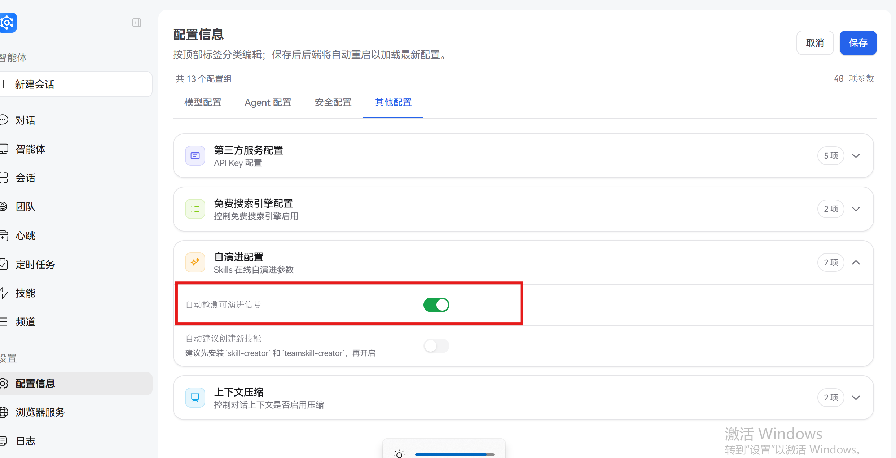
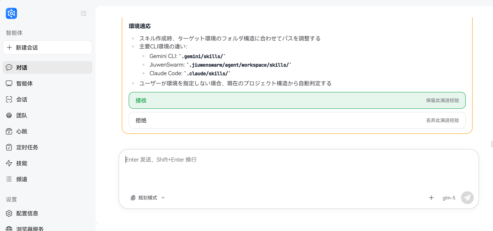
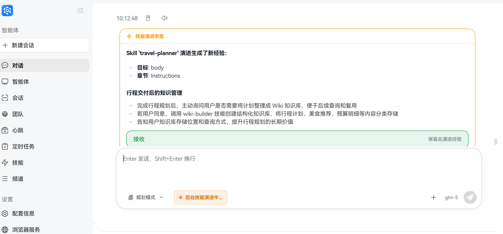

# Skill 自演进

## 1. 概念科普

### 1.1 Skill 自演进简介

Skill 自演进是 JiuwenSwarm 基于 openJiuwen 自演进框架实现的一项核心功能，它打破了传统 Agent 系统能力固定的局限。传统 Agent 系统的能力定义一旦写好，就基本不会再变——工具调用出错仅记录日志，用户反馈理解有误但下次仍使用同样逻辑。能力的上限从部署那天就已固定。

JiuwenSwarm 的 Skill 自演进机制通过内置的演进信号检测系统，持续监听执行过程和对话内容，将真实使用中遇到的问题自动转化为 Skills 的改进输入。它让 Skills 不再是一次性的静态文档，而是随着真实使用持续迭代的活文档。

### 1.2 核心价值

Skill 自演进机制的核心价值在于：

- **无需人工干预**：智能体在日常运转过程中自动完成对自身的改进
- **持续能力提升**：随着使用时间增加，Skills 的准确性和可靠性不断提高
- **自适应场景变化**：能够根据实际使用场景自动调整和优化
- **降低维护成本**：减少了手动更新和维护 Skills 的工作量

## 2. 使用方法

### 2.1 自演进配置开关

Skill 自动演进功能通过在配置信息中开启自演进配置项 `evolution_auto_scan` 开关启用。



### 2.2 自动演进（无需干预）

系统会在每次工具执行和对话结束后自动检测演进信号。当检测到执行异常或用户纠错时，会自动生成演进记录并存入 `evolutions.json`。

你无需做任何操作，演进在后台静默进行。下次调用该 Skill 时，会自动加载包含演进经验的内容。



### 2.3 手动触发演进

如果希望立即为某个 Skill 触发演进，可以输入：

```bash
/evolve <skill_name>
```

例如：

```bash
/evolve xlsx
```

系统会扫描最近的对话和执行记录，为该 Skill 生成演进经验，并显示生成结果。



### 2.4 查看演进状态

想知道哪些 Skill 有待固化的演进经验，可以输入：

```bash
/evolve list
```

系统会列出所有包含待演进记录的 Skill 及具体内容摘要。


### 2.5 管理演进经验

演进经验存储在 Skill 目录下的 `evolutions.json` 文件中，你可以直接编辑该文件来管理演进经验：

**目录位置：**
```
~/.jiuwenswarm/workspace/agent/skills/<skill_name>/
├── SKILL.md           # Skill 源文档
├── evolutions.json    # 演进经验记录 ← 在这里编辑
└── ...
```

**常用操作：**
- 添加新记录：在 `entries` 数组中追加新对象
- 修改记录：编辑 `change.content` 字段来更新演进内容
- 删除记录：从数组中移除
- 标记已固化：将 `applied` 设为 `true`（系统在固化时也会自动切换此字段）

⚠️ **注意**：不要修改系统管理字段，如 `id`、`source`、`timestamp`、`context`、`section`、`action`、`target`、`relevant`。这些字段由系统生成和维护。

修改后在下次对话时会自动加载。

## 3. 案例实践：通过文字对话字段触发代码修改

### 3.1 场景背景

假设我们有一个简单的 `file-operations` Skill，用于处理文件操作。该 Skill 包含一个 `read_file` 功能，用于读取文件内容。

**初始 SKILL.md 定义：**
```markdown
# file-operations Skill

## Functions

### read_file
- 功能：读取指定文件的内容
- 参数：
  - `file_path`: 文件路径
- 返回：文件内容

## Examples
- 读取文件：read_file({"file_path": "/path/to/file.txt"})
```

### 3.2 对话触发演进过程

#### 第一轮对话：发现问题

```
User: 帮我读取当前目录下的 test.txt 文件
Assistant: 好的，我将为您读取当前目录下的 test.txt 文件。
Tool: file-operations.read_file({
  "file_path": "test.txt"
})
Tool Response: Error: File not found: test.txt
Assistant: 对不起，我找不到 test.txt 文件。请问文件的完整路径是什么？
```

系统检测到工具执行失败（`File not found`），自动触发演进信号。

#### 第二轮对话：用户提供完整路径

```
User: 应该是 ./test.txt
Assistant: 好的，我将为您读取 ./test.txt 文件。
Tool: file-operations.read_file({
  "file_path": "./test.txt"
})
Tool Response: 这是 test.txt 文件的内容。
Assistant: 已成功读取 ./test.txt 文件，内容如下：
这是 test.txt 文件的内容。
```

#### 第三轮对话：用户反馈

```
User: 不对，当我只提供文件名时，你应该自动在当前目录查找，不需要我手动添加 ./
Assistant: 非常感谢您的反馈。我会优化这个功能，使其在只提供文件名时自动在当前目录查找。
```

系统检测到用户纠错反馈（"不对"），再次触发演进信号。

### 3.3 自动生成的演进记录

系统自动在 `file-operations` Skill 目录下的 `evolutions.json` 文件中生成演进记录。

### 3.4 演进后的效果

当 Skill 再次被调用时，它会自动加载演进经验，改进后的功能如下：

```
User: 帮我读取当前目录下的 test.txt 文件
Assistant: 好的，我将为您读取当前目录下的 test.txt 文件。
Tool: file-operations.read_file({
  "file_path": "test.txt"
})
Tool Response: 这是 test.txt 文件的内容。
Assistant: 已成功读取 test.txt 文件，内容如下：
这是 test.txt 文件的内容。
```

现在，当用户只提供文件名时，系统会自动在当前目录查找，无需用户手动添加 `./` 前缀。

## 4. 特性解读：原理与机制

### 4.1 核心组件

#### 4.1.1 SkillCallOperator

SkillCallOperator 是 JiuwenSwarm 与 Skills 交互的核心入口，负责 Skills 的统一管理：

- 读取 Skill 定义（SKILL.md）
- 执行 Skill 指令
- 自动加载 Skill 积累的演进经验

当系统检测到需要改进的地方，这些改进会先存入 `evolutions.json`，SkillCallOperator 会把它们合并后一起返回给 Agent。

#### 4.1.2 SkillOptimizer

SkillOptimizer 是驱动整个 Skill 演进流程的优化器：

1. **接收信号**：从 SignalDetector 接收异常信号，理解当前 Skill 遇到的问题
2. **分析判断**：结合对话上下文，判断问题是否值得记录
3. **生成改进**：调用 LLM 生成具体的改进建议
4. **执行记录**：将生成的改进方案写入演进记录

使用 `/evolve` 命令时，背后就是 SkillOptimizer 在工作。

#### 4.1.3 SkillEvolutionManager

SkillEvolutionManager 是演进生命周期的核心管理者，负责协调各个阶段的演进工作：

- **信号扫描**：调用 SignalDetector 提取需要演进的事件
- **记录生成**：调用 LLM 将信号转化为可执行的改进方案
- **存储管理**：维护 `evolutions.json` 文件的读写
- **内容固化**：将待定演进记录合并到原始 SKILL.md

它衔接了 SignalDetector、SkillOptimizer 和 SkillCallOperator，形成完整的演进闭环。

#### 4.1.4 SignalDetector

SignalDetector 是演进信号的检测器，持续监听对话和执行结果中的异常：

- 监听每一次工具执行的结果，捕捉错误关键词
- 捕捉用户的纠正反馈（如"不对"、"应该"等）
- 判断信号应该归到哪个 Skill 并关联上下文

SignalDetector 基于规则工作，不需要调用 LLM，因此响应速度快。

### 4.2 信号检测机制

#### 4.2.1 执行异常检测

系统会自动检测工具执行中的异常，包括：
- 工具调用超时
- 接口返回报错
- 代码执行中的异常中断

检测关键词包括但不限于：
- 通用错误：`error`、`exception`、`failed`、`failure`、`timeout`
- 网络相关：`connection error`、`econnrefused`、`enoent`
- 权限相关：`permission denied`、`command not found`

#### 4.2.2 用户纠错检测

系统会识别用户的纠错反馈，这类信号往往比报错日志更有价值：

- 中文模式：`不对`、`不是这`、`错 了`、`应该 是`、`你搞错了`、`纠正一下`
- 英文模式：`that's wrong`、`you're wrong`、`should be`、`actually`

### 4.3 演进流程

```text
用户对话 / 工具执行
        │
        ▼
┌───────────────────┐
│  SignalDetector   │  监听并识别信号
│   检测执行异常     │
│   检测用户纠错     │
└────────┬──────────┘
         │
         ▼
┌─────────────────────────────┐
│    SkillEvolutionManager    │
│         .scan()            │  提取演进信号
└────────────┬───────────────┘
             │
             ▼
┌─────────────────────────────┐
│    SkillEvolutionManager    │
│       .generate()          │  LLM 生成演进记录
└────────────┬───────────────┘
             │
             ▼
┌─────────────────────────────┐
│      evolutions.json        │  写入待固化记录
│    (Skill 目录下)          │
└────────────┬───────────────┘
             │
             ▼ (可选)
┌─────────────────────────────┐
│         .solidify()         │  合并到 SKILL.md
└─────────────────────────────┘
```

### 4.4 演进记录存储

演进记录存储在每个 Skill 目录下的 `evolutions.json` 文件中：

```json
{
  "skill_id": "<skill_name>",
  "version": "1.0.0",
  "updated_at": "2024-01-15T10:30:00Z",
  "entries": [
    {
      "id": "ev_1234abcd",
      "source": "execution_failure",
      "timestamp": "2024-01-15T10:30:00Z",
      "context": "API timeout after 30s",
      "change": {
        "section": "Troubleshooting",
        "action": "append",
        "content": "## 常见问题\n- 遇到 API 超时错误时..."
      },
      "applied": false
    }
  ]
}
```

其中：
- `applied: false` 表示待固化状态
- `applied: true` 表示已固化到 SKILL.md