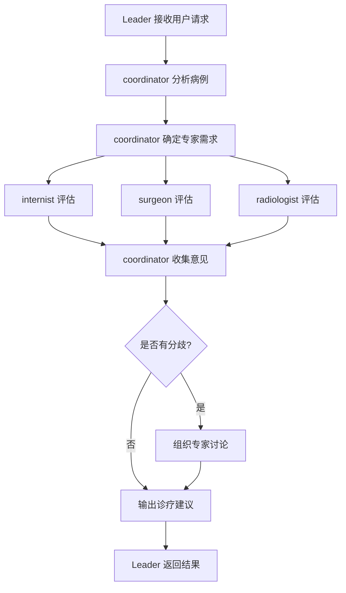
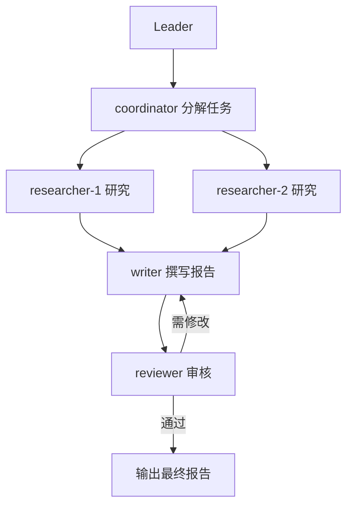

# Team Skills 团队技能

JiuwenClaw 的 **Team Skills（团队技能）** 是一种面向多 Agent 协作的标准化能力包。它不是单个 Agent 的能力补丁，而是把一次优秀的团队协作流程沉淀为可复用、可复制、可进化的团队协作 SOP，让复杂任务不再每次都从零开始临时编排。

---

## 1. 概念科普

### 1.1 Team Skills 的定位

Team Skills 是 JiuwenClaw 技能体系中的**多 Agent 协作层**。如果说 Agent Skill 解决的是"一个 Agent 怎么做事"，那么 Team Skills 解决的就是"一个 Agent 团队怎么配合做事"。

在传统的 AI Agent 使用中，面对复杂任务时，用户往往需要手动编排多个 Agent 的协作方式——谁来做什么、谁先谁后、出了问题怎么办。这种方式每次都要从零开始，协作质量不稳定，流程难以复用。Team Skills 的出现，正是为了解决这个痛点：

- **一次沉淀，反复使用**：将经过验证的团队协作流程封装为标准化的能力包，下次遇到同类任务直接调用，无需重新编排。
- **流程可进化**：协作流程不是一成不变的，可以根据实际使用反馈持续优化和迭代。
- **质量可预期**：预定义的角色分工、协作顺序和异常处理策略，让每次协作的输出质量更加稳定。

### 1.2 Team Skills 与 Agent Skills 的区别

| 维度 | Agent Skill | Team Skill |
|------|-------------|------------|
| **定位** | 单个 Agent 的能力扩展 | 多 Agent 团队的协作模式封装 |
| **关注点** | 一个 Agent 怎么做事 | 一个 Agent 团队怎么配合做事 |
| **结构** | 单一 `SKILL.md` 文件 | 目录结构（SKILL.md + roles + workflow + bind + dependencies） |
| **适用场景** | 单一任务，一个 Agent 可完成 | 需要多角色协作、流程复用的复杂任务 |
| **协作方式** | 无协作，Agent 独立执行 | 预定义角色分工、协作流程和异常处理 |
| **复用性** | 能力可复用 | 协作流程可复用 |

简单类比：Agent Skill 像是给一个人增加一项专业技能（如"会做数据分析"），而 Team Skill 像是给一个团队制定一套协作 SOP（如"研究团队如何从调研到撰写到审核完成一份报告"）。

### 1.3 Team Skills 的通用性

Team Skills 不只局限于 JiuwenClaw 平台。它的核心设计理念——角色分工、协作流程、边界约束——是一种通用的团队协作能力封装方式，可以适配到支持相关协作标准的其他 AI Agent 框架中。这意味着：

- 在 JiuwenClaw 中创建的 Team Skill，理论上可以迁移到其他支持类似协作标准的平台使用。
- Team Skills 的标准化结构（5 文件规范）为跨框架互操作提供了基础。
- 社区贡献的 Team Skill 可以在不同平台间共享，共建团队技能生态。

---

## 2. 组成结构

一个 Team Skill 本质上是一个**结构化的目录**，而非单一的说明文件。这种设计使得团队协作的各个要素——角色、流程、边界、依赖——能够被清晰地组织和维护。

### 2.1 目录结构概览

```
team-skill-name/
├── SKILL.md              # 团队技能入口文件
├── roles/                # 角色定义目录
│   ├── coordinator.md    # 协调者角色
│   ├── researcher.md     # 研究员角色
│   └── writer.md         # 撰写者角色
├── workflow.md           # 协作流程定义
├── bind.md               # 边界与异常处理规则
├── dependencies.yaml     # 外部依赖声明
├── examples/             # 可选：示例与模板
│   └── sample-case.md
├── templates/            # 可选：输出模板
│   └── report-template.md
└── assets/               # 可选：资源文件
    └── diagrams/
```

### 2.2 关键文件说明

| 文件 | 作用 | 必需 |
|------|------|------|
| `SKILL.md` | 团队技能入口文件，定义技能名称、描述、适用场景等元信息，以及角色列表和文件索引 | 是 |
| `roles/*.md` | 角色定义文件，每个文件描述一个 Agent 角色的职责、能力和行为规范 | 是 |
| `workflow.md` | 协作流程定义，描述角色之间的交互顺序、任务流转和决策节点（含 mermaid 流程图） | 是 |
| `bind.md` | 边界与异常处理规则，定义协作的资源约束、行为约束和失败处理策略 | 是 |
| `dependencies.yaml` | 外部依赖声明，列出技能运行所需的工具、其他技能等 | 是 |

### 2.3 核心文件详解

#### SKILL.md — 团队入口

`SKILL.md` 是 Team Skill 的入口文件，采用 YAML frontmatter 声明元信息：

```markdown
---
name: medical-consultation-team
version: 1.0.0
author: jiuwenclaw-team
description: |
  多学科医疗专家会诊团队技能，通过协调者组织多专科专家并行评估并整合意见。
  Use when 需要多学科专家共同评估复杂病例并输出结构化诊疗建议。
  Do NOT use for 单一专科可独立判断的简单病例。
kind: team-skill
roles:
  - id: coordinator
    purpose: 组织专家、汇总意见、输出诊疗建议
    skills: []
    tools: []
  - id: internist
    purpose: 从内科角度评估病例
    skills: []
    tools: []
  - id: surgeon
    purpose: 从外科角度评估病例
    skills: []
    tools: []
  - id: radiologist
    purpose: 从影像学角度分析病例
    skills: []
    tools: []
---

# 医疗会诊团队技能

本团队技能采用专业化流水线模式（C 模式），组织多学科医疗专家进行病例会诊，解决单 Agent 角色扮演多视角时产生的收敛偏差问题。

## Workflow

0. **预检：检查依赖** — 读取 [dependencies.yaml](dependencies.yaml) 并验证。报告缺失项：`required: true` = 缺少则可能失败；`required: false` = 降级但可用。**用户决定**是否继续。
1. **coordinator 接收病例** — 分析病例，确定专家需求，创建会诊任务。
2. **各专家并行评估** — internist / surgeon / radiologist 独立评估并提交专科意见。
3. **coordinator 整合意见** — 收集所有专家意见，识别分歧，如有分歧组织讨论。
4. **输出诊疗建议报告** — coordinator 整合最终意见，输出结构化报告。

## Roles

| id | Purpose | When dispatched | Input | Key dependencies | Role file |
|---|---------|----------------|-------|-----------------|-----------|
| coordinator | 组织专家、汇总意见 | 每次运行 | 用户提交的病例 | — | [roles/coordinator.md](roles/coordinator.md) |
| internist | 从内科角度评估 | 每次运行（并行） | 分发的病例资料 | — | [roles/internist.md](roles/internist.md) |
| surgeon | 从外科角度评估 | 每次运行（并行） | 分发的病例资料 | — | [roles/surgeon.md](roles/surgeon.md) |
| radiologist | 从影像学角度分析 | 每次运行（并行） | 分发的病例资料 | — | [roles/radiologist.md](roles/radiologist.md) |

> 在分派每个队友之前，读取对应的角色文件并提取 `## Inline Persona for Teammate` 部分，直接粘贴到分派提示词中。

## Files

| File | What it contains | When to read |
|------|------------------|-------------|
| [workflow.md](workflow.md) | Mermaid 流程图、步骤协议、集成规则、最终报告格式 | 首次分派前 — 完整执行手册 |
| [bind.md](bind.md) | 资源限制、行为约束、失败处理和降级模式 | 遇到限制、处理失败或需要降级规则时 |
| [roles/*.md](roles/) | 每个角色的身份、成功标准、输出格式、Inline Persona | 分派每个队友前 — 提取 Inline Persona |
| [dependencies.yaml](dependencies.yaml) | 外部技能和工具依赖 | **启动时** — 验证依赖，报告缺失项，用户决定是否继续 |
```

**关键字段说明**：

- **`name`**：技能的唯一标识符，必须与目录名一致（kebab-case，约定以 `-team` 结尾）。
- **`kind`**：必须为 `team-skill`（注意：不是 `type`），用于区分 Team Skill 和普通 Agent Skill。
- **`roles`**：角色列表，**至少 2 个角色**，每个角色必须包含 `id`（角色标识）、`purpose`（一句话职责描述，≤150 字符）、`skills`（依赖的技能列表）和 `tools`（依赖的工具列表）。
- **`description`**：技能描述，遵循简洁原则（≤4 行、≤500 字符），采用 WHAT / WHEN / NOT 三行结构。

#### roles/*.md — 角色定义

每个角色文件定义一个 Agent 的职责和行为，包含 5 个必需章节：

1. **`## Identity`**：角色身份定义，第一行必须是 1 行格言（motto），如 `> *"我试图在生产环境中破坏这段代码。"*`，这是最重要的反收敛机制。
2. **`## Success Criteria`**：成功标准，列出角色需要达成的目标。
3. **`## Boundary`**：边界定义，必须包含 `**Forbidden**`（禁止做的事，防止角色重叠）和 `**Mandatory**`（必须做的事，防止偷懒）。
4. **`## Output Schema`**：输出格式，定义角色产出的结构。
5. **`## Inline Persona for Teammate`**：内联人格提示词，完整的可粘贴提示词，供 Leader 在分派任务时直接注入。

示例：

```markdown
---
role_name: coordinator
description: 会诊协调者，负责组织专家、汇总意见
---

# 协调者角色

## Identity

> *"我负责让每位专家的声音被听见，并确保最终建议是共识而非妥协。*

协调者是会诊流程的驱动者，不直接给出医学意见，而是确保各专家意见被充分表达和整合。

## Success Criteria

- 所有受邀专家均提交了专科意见
- 意见分歧点已被识别并讨论
- 最终诊疗建议是结构化的、可执行的

**Focus areas**: 意见整合质量、流程完整性

## Boundary

**Forbidden**:
- 直接给出医学诊断意见
- 替代专家做专业判断
- 隐瞒专家间的分歧

**Mandatory**:
- 确保每位专家都收到完整的病例资料
- 在报告中标注意见分歧及处理方式
- 输出结构化的诊疗建议

## Output Schema

```markdown
# 会诊报告
## 患者信息
## 专家意见汇总
### [专家1] 意见
### [专家2] 意见
## 综合诊疗建议
## 紧急程度
```

## Inline Persona for Teammate

你是一位会诊协调者。你的职责是：
1. 接收并分析病例信息
2. 确定需要参与的专家类型
3. 向各专家分发病例资料
4. 收集并汇总各专家意见
5. 识别意见分歧并组织讨论
6. 输出结构化的诊疗建议报告

你不直接给出医学诊断意见，而是确保各专家意见被充分表达和整合。
```

#### workflow.md — 协作流程

定义角色之间的交互顺序和任务流转，包含 3 个必需章节：

1. **`## Overview`**：流程概览，必须包含 mermaid 流程图，这是 Team Skill 与单 Agent Skill 的核心表达差异。
2. **`## Detailed Steps`**：详细步骤，每步包含执行者、输入、输出、串行/并行标记和质量门控。
3. **`## Acceptance Criteria`**：验收标准，判断一次协作是否成功的标准。

示例：

```markdown
# 会诊协作流程

## Overview



## Detailed Steps

### 步骤 1：病例接收与分析
- **执行者**: coordinator
- **输入**: 用户提交的病例信息
- **输出**: 专家需求列表 + 会诊任务
- **方式**: 串行
- **质量门控**: 如果病例信息不足，向用户请求补充

### 步骤 2：专家评估
- **执行者**: internist / surgeon / radiologist（并行）
- **输入**: 分发的病例资料
- **输出**: 各专科意见
- **方式**: 并行
- **质量门控**: 如果某专家超时未响应，跳过并在报告中标注缺失

### 步骤 3：意见整合
- **执行者**: coordinator
- **输入**: 各专家意见
- **输出**: 整合意见 + 分歧识别
- **方式**: 串行
- **质量门控**: 如果存在严重分歧，组织专家讨论

### 步骤 4：输出结果
- **执行者**: coordinator → Leader
- **输入**: 整合后的意见
- **输出**: 结构化诊疗建议报告
- **方式**: 串行
- **质量门控**: 报告必须包含所有专家意见和分歧处理说明

## Acceptance Criteria

- 所有受邀专家均提交了意见（或缺失意见已标注）
- 意见分歧已被识别和处理
- 最终报告是结构化的、包含综合诊疗建议
```

#### bind.md — 边界与异常处理

定义协作的约束条件和异常处理策略，包含 3 个必需章节：

1. **`## Resource Constraints`**：资源约束，至少包含 `max_parallel_teammates`、`total_wall_clock_budget`、`total_token_budget`。
2. **`## Behavioral Constraints`**：行为约束，团队级规则（如 Leader 不写内容、队友间不可互相看到输出等）。
3. **`## Failure Handling`**：失败处理，覆盖队友失败（超时、输出异常）和输入过大时的降级策略。

示例：

```markdown
# 边界与异常处理

## Resource Constraints

| 约束项 | 值 |
|--------|-----|
| max_parallel_teammates | 5 |
| total_wall_clock_budget | 30 分钟 |
| total_token_budget | 50000 |

## Behavioral Constraints

- Leader 不直接撰写医学内容，只负责调度和整合
- 各专家之间不可互相看到对方的原始意见（隔离评估）
- coordinator 必须在报告中标注所有意见分歧
- 单次会诊最多邀请 5 位专家

## Failure Handling

### 专家不可用
- **策略**: 跳过该专家，在报告中标注缺失意见
- **降级**: 如关键专家不可用，提示用户重新安排

### 意见严重分歧
- **策略**: 组织专家讨论，记录各方理由
- **输出**: 在报告中呈现不同方案及依据

### 信息不足
- **策略**: 向用户请求补充信息
- **超时**: 如用户未响应，基于现有信息给出保守建议

### 输入过大
- **策略**: 病例资料超过 2000 字时，coordinator 先做摘要再分发给专家
```

#### dependencies.yaml — 外部依赖

声明技能运行所需的外部资源，必须包含 `skills` 和 `tools` 两个段（即使为空也需显式写 `[]`）：

```yaml
skills:
  - name: web-research
    source: local
    required: false
    purpose: 辅助专家查阅最新医学文献
  - name: report-generator
    source: local
    required: true
    purpose: 生成结构化诊疗建议报告

tools:
  - name: readFile
    required: true
    purpose: 读取病例资料文件
  - name: writeFile
    required: true
    purpose: 输出诊疗建议报告
```

**字段说明**：

| 字段 | 适用段 | 必需 | 说明 | 取值示例 |
|------|--------|------|------|----------|
| `name` | skills, tools | 是 | 技能/工具名称 | `web-research`, `readFile` |
| `source` | skills | 是 | 技能来源 | `local`（本地）、`hub`（技能中心） |
| `required` | skills, tools | 是 | 是否必需 | `true`（必需）、`false`（可选） |
| `purpose` | skills, tools | 是 | 用途说明（≤150字符） | `辅助专家查阅最新医学文献` |

> **注意**：即使没有依赖，也必须显式写 `skills: []` 和 `tools: []`（空列表表示"已检查，确认无依赖"，与省略段不同，省略是规范违规）。

---

## 3. 使用指导

### 3.1 如何开始使用 Team Skills

用户通常通过以下步骤开始使用 Team Skills：

**步骤一：从 Team Skills Hub 获取现成技能**

1. 打开 JiuwenClaw 的「技能」面板
2. 点击「Team Skills Hub 在线搜索」
3. 输入关键词搜索所需的团队技能（如"医疗会诊"、"研究报告"等）
4. 点击「安装」将技能添加到工作区

也可以通过命令行搜索和安装：

```
# 搜索 Team Skills
/teamskills search "医疗会诊"

# 查看 Team Skill 详情
/teamskills info <asset_id> --version 1.0.0

# 安装 Team Skill
/teamskills install <asset_id> --version 1.0.0
```

> **提示**：`<asset_id>` 是 Team Skills Hub 上的技能唯一标识（如 `sk-123`），搜索结果中会显示。

**步骤二：在 JiuwenClaw 中使用**

安装完成后，Team Skill 会自动出现在可用技能列表中：

1. 在对话中描述你的任务目标
2. 系统会识别并调用相应的 Team Skill
3. 团队协作流程按既定方式自动运行
4. 获得结构化的输出结果

### 3.2 什么场景更适合使用 Team Skills

Team Skills 特别适合以下场景：

| 场景特征 | 说明 | 示例 |
|----------|------|------|
| 任务链路长 | 需要多个步骤、多个阶段才能完成的复杂任务 | 从调研到撰写到审核完成一份研究报告 |
| 角色分工明确 | 任务可以分解为不同专业领域的子任务 | 多学科医疗会诊需要内科、外科、影像科专家 |
| 希望复用成熟流程 | 不想每次都重新设计协作方式 | 定期执行的代码审查、安全审计 |
| 输出需要结构化 | 需要标准化的报告、方案或建议 | 诊疗建议报告、研究报告、审计报告 |

**对比：何时使用单 Agent Skill vs Team Skill**

| 情况 | 推荐选择 | 原因 |
|------|----------|------|
| 单一任务，一个 Agent 可完成 | 单 Agent Skill | 无需多角色协作，Team Skill 会增加不必要的开销 |
| 需要多步推理，但无需角色分工 | 单 Agent Skill + 工作流 | 流程可以由单个 Agent 按步骤执行 |
| 需要多个专业角色协作 | **Team Skill** | 不同角色的专业视角不可替代 |
| 任务流程固定、需要复用 | **Team Skill** | 预定义流程可反复使用，质量更稳定 |
| 需要对抗性检查（如代码审查） | **Team Skill** | 单 Agent 角色扮演多个视角容易产生收敛偏差 |

### 3.3 使用重点

Team Skills 的核心价值在于：**选择合适的 Team Skill，让团队协作流程按既定方式自动运行**，而不是手动编排每个 Agent。

使用时的三个重点：

1. **选择合适的 Team Skill**：根据任务特点选择匹配的团队技能。如果现有技能不完全匹配，可以基于 `teamskill-creator` 修改已有技能或创建新技能。
2. **提供清晰的输入**：按照技能要求提供完整的任务信息。输入越清晰，协作输出质量越高。
3. **理解输出结构**：了解技能的输出格式，便于后续处理和使用。

Team Skills 相比临时组队的三大优势：

| 优势点 | 临时组队 | Team Skill |
|--------|----------|------------|
| 分工规则 | 每次需重新分配，可能遗漏或混乱 | 预定义，稳定可靠 |
| 协作顺序 | 可能遗漏关键步骤 | workflow.md 明确规定 |
| 异常处理 | 临时决策，不一致 | bind.md 统一策略 |

### 3.4 跨框架复用潜力

Team Skills 采用标准化的结构定义（5 文件规范），具备跨框架复用潜力：

- 协作标准基于通用的角色-流程-边界模型，不依赖特定框架的实现细节
- 可适配到支持相关协作标准的其他 AI Agent 平台
- 便于在不同框架间迁移和共享团队协作经验
- Team Skills Hub 作为社区共享平台，促进跨框架的技能生态共建

---

## 4. 案例实践

### 4.1 案例：多学科医疗专家会诊

本案例展示 Team Skills 在医疗会诊场景中的实际应用价值。

#### 适用场景

- 患者病情复杂，涉及多个系统
- 需要不同专科专家共同评估
- 希望获得综合、结构化的诊疗建议

#### 用户输入

```
患者信息：
- 男性，65岁
- 主诉：胸痛伴呼吸困难2天
- 既往史：高血压、糖尿病
- 检查结果：心电图ST段抬高，D-二聚体升高

请组织专家会诊，给出诊疗建议。
```

#### 团队协作过程

**阶段一：病例接收与分析**

```
[coordinator] 接收病例信息
[coordinator] 分析：胸痛+心电图异常+D-二聚体升高 → 涉及心血管和呼吸系统
[coordinator] 确定需要专家：心内科、呼吸科、影像科
[coordinator] 创建会诊任务 #2024-001
```

**阶段二：专家评估（并行）**

```
[internist] 评估内科方面：
- ST段抬高提示心肌损伤可能
- 建议：完善心肌酶谱、心脏超声
- 初步意见：排除急性冠脉综合征

[surgeon] 评估外科方面：
- D-二聚体升高+呼吸困难
- 建议：完善肺动脉CTA
- 初步意见：排除肺栓塞

[radiologist] 影像分析：
- 建议胸部CT平扫+增强
- 关注肺动脉、冠状动脉情况
```

**阶段三：意见整合**

```
[coordinator] 收集专家意见
[coordinator] 识别关键分歧：心源性 vs 肺源性
[coordinator] 组织专家讨论
[专家共识]：优先排除危及生命的情况
           建议同时进行心脏和肺血管评估
```

**阶段四：输出结果**

```markdown
# 会诊报告 #2024-001

## 患者信息
- 男性，65岁，胸痛伴呼吸困难2天

## 专家意见汇总

### 内科意见
- ST段抬高提示心肌损伤，需排除急性冠脉综合征
- 建议检查：心肌酶谱、心脏超声、冠脉CTA

### 外科意见
- D-二聚体升高需警惕肺栓塞
- 建议检查：肺动脉CTA、血气分析

### 影像科意见
- 建议胸部CT增强扫描，一站式评估

## 综合诊疗建议
1. 立即完善心肌酶谱、血气分析（急诊完成）
2. 行胸部CT增强扫描，同时评估冠脉和肺动脉
3. 心电监护，监测生命体征
4. 根据检查结果决定下一步治疗方案

## 紧急程度
⚠️ 高危 - 需立即处理

---
会诊时间：2024-01-15 14:30
参与专家：内科张医生、外科李医生、影像科王医生
```

#### Team Skills 的优势体现

| 优势点 | 临时组队 | Team Skill |
|--------|----------|------------|
| 分工规则 | 每次需重新分配谁看什么 | 预定义角色（内科/外科/影像科），稳定可靠 |
| 协作顺序 | 可能遗漏步骤（如忘记整合分歧） | workflow.md 明确规定：分析→评估→整合→输出 |
| 异常处理 | 专家超时怎么办？临时决定 | bind.md 统一策略：跳过并标注缺失 |
| 输出格式 | 每次格式不同 | 结构化、标准化报告 |
| 复用性 | 下次会诊又要从零开始 | 同一 Team Skill 可反复使用 |

### 4.2 案例：研究与 PPT 撰写团队

本案例展示 Team Skills 在内容生产场景中的应用。

#### 适用场景

- 需要从研究调研到 PPT 撰写的完整链路
- 研究和撰写需要不同专业能力
- 希望输出结构化的演示文稿

#### 用户输入

```
请帮我完成一份关于"2024年AI行业趋势"的研究报告PPT，
需要包含市场数据、技术趋势和未来展望。
```

#### 团队协作过程

**阶段一：任务分解**

```
[coordinator] 接收研究主题："2024年AI行业趋势"
[coordinator] 分解研究问题：市场数据、技术趋势、未来展望
[coordinator] 分配研究任务给 researcher
```

**阶段二：并行研究**

```
[researcher-1] 研究市场数据：市场规模、增长率、主要玩家
[researcher-2] 研究技术趋势：大模型、多模态、Agent化
[researcher-3] 研究未来展望：监管趋势、应用前景、挑战
```

**阶段三：报告撰写**

```
[writer] 整合所有研究发现
[writer] 撰写 PPT 内容：每页标题、要点、数据图表建议
```

**阶段四：审核修订**

```
[reviewer] 审核报告：逻辑连贯性、数据准确性、表达清晰度
[writer] 根据审核意见修订
[coordinator] 输出最终 PPT 内容
```

---

## 5. 创建指导

### 5.1 使用 teamskill-creator 创建新的 Team Skill

JiuwenClaw 提供了 `teamskill-creator` 技能，帮助用户创建、转换或修改 Team Skill。它内置了标准化的模板、决策树和自动化验证器，确保创建的 Team Skill 符合规范。

**获取与安装**：

`teamskill-creator` 是 JiuwenClaw 的内置技能，无需额外安装。如果您的环境中没有该技能，可以通过以下方式获取：

```bash
# 从技能中心搜索并安装
/skills search teamskill-creator
/skills install teamskill-creator
```

**三种模式**：

| 模式 | 适用场景 | 输出 |
|------|----------|------|
| **CREATE** | 从零创建新的团队技能 | 新的 `<teamskill-name>/` 目录，包含完整的 5 文件集 |
| **CONVERT** | 将现有单 Agent Skill 转换为 Team Skill | 转换后的 `<teamskill-name>/` 目录 + 差异报告 |
| **MODIFY** | 修改已有 Team Skill（增删角色、调整流程等） | 更新后的文件 |

#### 创建流程示例

以下以创建「研究与报告撰写团队」为例，展示完整的创建过程：

**步骤一：判断是否需要 Team Skill**

首先确认：这个任务是否真的需要多角色协作？Team Skill 仅在以下情况才值得创建：

1. **对抗性盲区**：单 Agent 角色扮演多个视角会产生收敛偏差（如代码审查、安全审计）
2. **并行分解收益**：多个独立子任务可以并行执行，且整合非平凡（如多角度研究）
3. **专业化流水线**：顺序阶段有质量门控，模糊阶段边界会导致质量下降（如营销文案：简报→草稿→编辑→审核）

如果以上都不适用 → 建议使用单 Agent Skill。

**步骤二：选择协作模式**

根据任务特点选择协作模式：

| 模式 | 适用场景 | 角色数 | 角色间可见性 |
|------|----------|--------|-------------|
| A. 对抗/交叉检查 | 盲区问题 | 2-4 | 不可见（隔离是价值所在） |
| B. 并行分解 | 独立子任务 | 2-N | 直到整合阶段才可见 |
| C. 专业化流水线 | 顺序专家阶段 | 3-5 | 每阶段可见前一阶段输出 |
| 混合模式 | 多种理由叠加 | 4-6 | 按阶段区分 |

研究与报告撰写团队适合 **C. 专业化流水线** 模式（研究→撰写→审核，顺序阶段有质量门控）。

**步骤三：设计角色**

为每个角色编写 `roles/<id>.md` 文件，包含 5 个必需章节：

```
research-report-team/
├── roles/
│   ├── coordinator.md    # 协调者：分解任务、整合结果
│   ├── researcher.md     # 研究员：独立研究、提交发现
│   ├── writer.md         # 撰写者：整合研究、撰写报告
│   └── reviewer.md       # 审核者：审核报告、提出修改意见
```

**反重叠测试**：写出每个角色的 1 行格言，然后问"一个角色的产出能否替代另一个角色的？"如果可以，说明边界模糊，需要重新设计。

**步骤四：编写协作流程**

编写 `workflow.md`，包含 mermaid 流程图、详细步骤和验收标准：

```markdown
## Overview


```

**步骤五：编写边界与异常处理**

编写 `bind.md`，定义资源约束、行为约束和失败处理：

```markdown
## Resource Constraints

| 约束项 | 值 |
|--------|-----|
| max_parallel_teammates | 3 |
| total_wall_clock_budget | 45 分钟 |
| total_token_budget | 80000 |

## Behavioral Constraints

- Leader 不直接撰写内容，只负责调度
- researcher 之间不可互相看到对方的研究过程（保证独立性）
- writer 必须整合所有研究发现，不可遗漏
- 审核最多 2 轮

## Failure Handling

### 研究信息不足
- 策略：向用户请求补充研究方向
- 超时：基于现有研究给出保守结论

### 审核意见分歧
- 策略：coordinator 仲裁，选择更合理的修改方向
```

**步骤六：编写依赖声明和入口文件**

编写 `dependencies.yaml` 和 `SKILL.md`，这两文件引用前面步骤产出的内容。

**步骤七：验证**

运行自动化验证器，确保 Team Skill 符合规范：

```bash
# 方式一：使用 TUI 内置命令（推荐）
/teamskills validate path/to/research-report-team/ --type teamskills

# 方式二：使用独立验证脚本
python scripts/validate_teamskill.py path/to/research-report-team/
```

验证器检查：
- 5 文件是否齐全
- frontmatter 必需字段是否完整（`name`、`kind`、`roles`）
- `roles` 至少 2 个，每个角色有 `id` 和 `purpose`，`id` 不可重复
- 角色文件名是否与 `roles[].id` 一致
- 各角色文件是否包含 5 个必需章节
- workflow.md 是否包含 mermaid 图
- bind.md 是否包含 3 个必需章节
- dependencies.yaml 是否包含 `skills` 和 `tools` 段
- SKILL.md 中声明的 `skills`/`tools` 是否在 dependencies.yaml 中出现

**退出码 0 = 合规**。非零退出码会打印具体的失败检查项。

### 5.2 修改已有 Team Skill

使用 `teamskill-creator` 的 MODIFY 模式可以修改已有的 Team Skill：

| 修改类型 | 需要重新执行的步骤 | 需要更新的文件 |
|----------|-------------------|---------------|
| 编辑角色 Identity / Boundary / Schema | 步骤 2（受影响角色） | `roles/<id>.md` |
| 增删角色 | 步骤 1a + 2 + 3 + 4 + 5 | 所有 5 文件 |
| 修改协作流程 | 步骤 3 | `workflow.md` + `bind.md`（如约束变化） |
| 修改边界约束 | 步骤 4 | `bind.md` |
| 修改依赖 | 步骤 2（自动匹配） + 5 | `dependencies.yaml` + `SKILL.md` |

**重要**：无论修改大小，步骤 7（验证）都必须执行。

### 5.3 将单 Agent Skill 转换为 Team Skill

使用 `teamskill-creator` 的 CONVERT 模式可以将现有的单 Agent Skill 转换为 Team Skill：

1. **读取源 SKILL.md**，识别自然角色边界：
   - 找到嵌入的多角色设定（如"扮演 Persona 1 / Persona 2 / Persona 3"）
   - 找到顺序阶段和质量门控（如"先做 X，再验证 Y，再产出 Z"）
   - 找到按类别分支的检查清单（如"[ ] 安全 [ ] 性能 [ ] 可读性"）
2. **明确转换价值**：单 Agent 形式下丢失了什么？这成为 Team Skill 的"为什么"
3. **继续从步骤 2 开始**，按 CREATE 流程完成

### 5.4 上传到 Team Skills Hub

创建完成后，可以将 Team Skill 分享到社区，共建团队技能生态：

**步骤一：验证完整性**

```bash
# 方式一：使用 TUI 内置命令（推荐）
/teamskills validate path/to/<teamskill-name>/ --type teamskills

# 方式二：使用独立验证脚本
python scripts/validate_teamskill.py path/to/<teamskill-name>/
```

确保退出码为 0（合规）。

**步骤二：上传发布**

在 JiuwenClaw 的「技能」面板中：
1. 点击「Team Skills Hub」
2. 选择要发布的 Team Skill
3. 点击「上传」
4. 首次使用需要认证（输入 Team Skills Hub Token）

也可以通过命令行发布：

```
# 发布到 Team Skills Hub（需要鉴权）
/teamskills publish path/to/<teamskill-name> --version 1.0.0 --token <TOKEN>

# 如需覆盖已有版本，添加 --force
/teamskills publish path/to/<teamskill-name> --version 1.0.1 --token <TOKEN> --force
```

> **鉴权说明**：发布和删除操作需要提供 `--token`（用户 Token）或 `--system-token`（系统 Token），且只能选择一种。Token 可通过 `/teamskills config --token <TOKEN>` 预配置，避免每次手动输入。

**步骤三：维护更新**

发布后可以持续迭代：
- 修改角色、流程或约束后重新验证
- 更新版本号后重新发布
- 根据社区反馈优化协作流程

### 5.5 最佳实践

| 实践 | 说明 |
|------|------|
| 角色粒度适中 | 角色不宜过细（增加协调成本）或过粗（失去分工优势） |
| 流程简洁清晰 | 避免过度复杂的协作流程，保持可理解性 |
| 边界条件明确 | 在 bind.md 中覆盖常见异常情况 |
| 提供示例 | 在 examples/ 中提供使用示例，降低学习成本 |
| 格言要有对抗性 | 每个角色的 motto 应体现独特视角，避免角色收敛 |
| 验证不可跳过 | 每次创建或修改后都必须运行验证器 |
| 描述遵循简洁原则 | SKILL.md description ≤4 行、≤500 字符，采用 WHAT / WHEN / NOT 结构 |

---

## 附录

### 快速参考

| 操作 | 命令/方式 |
|------|----------|
| 搜索 Team Skills | `/teamskills search <关键词>` |
| 查看 Team Skill 详情 | `/teamskills info <asset_id> --version <x.y.z>` |
| 安装 Team Skill | `/teamskills install <asset_id> --version <x.y.z>` |
| 查看已安装技能 | `/teamskills list` |
| 卸载 Team Skill | `/teamskills uninstall <name>` |
| 创建 Team Skill 脚手架 | `/teamskills init <name> --type teamskills` |
| 验证 Team Skill | `/teamskills validate <path> --type teamskills` |
| 打包 Team Skill | `/teamskills pack <path> --output <dir>` |
| 配置 Hub URL 和 Token | `/teamskills config --market-url <url> --token <TOKEN>` |
| 发布到 Team Skills Hub | `/teamskills publish <path> --version <x.y.z> --token <TOKEN>` |
| 删除 Hub 上的技能 | `/teamskills delete <skill_id> --version <x.y.z> --token <TOKEN>` |
| 使用 teamskill-creator 创建 | 使用 `teamskill-creator` 技能的 CREATE 模式 |
| 使用 teamskill-creator 修改 | 使用 `teamskill-creator` 技能的 MODIFY 模式 |
| 使用 teamskill-creator 转换 | 使用 `teamskill-creator` 技能的 CONVERT 模式 |

### 常见问题

**Q: Team Skill 和普通 Skill 有什么区别？**

A: 普通 Skill 是单一 Agent 的能力扩展（"一个 Agent 怎么做事"），而 Team Skill 封装了多 Agent 协作的完整模式（"一个 Agent 团队怎么配合做事"），包括角色分工、协作流程和异常处理策略。

**Q: 如何判断是否需要使用 Team Skill？**

A: 如果任务存在以下情况，适合使用 Team Skill：(1) 单 Agent 角色扮演多视角会产生收敛偏差；(2) 多个独立子任务可以并行执行；(3) 顺序阶段有质量门控需要专业化处理。如果以上都不适用，建议使用单 Agent Skill。

**Q: 可以修改已安装的 Team Skill 吗？**

A: 可以。使用 `teamskill-creator` 的 MODIFY 模式修改本地副本，修改后需重新运行验证器确认合规。

**Q: Team Skill 的 5 文件结构都是必需的吗？**

A: 是的。SKILL.md、roles/、workflow.md、bind.md、dependencies.yaml 都是必需文件。验证器会检查所有 5 个文件是否齐全。`examples/`、`templates/`、`assets/` 等扩展目录是可选的。

**Q: Team Skills Hub 的默认地址是什么？**

A: 默认地址为 `https://teamskills.openjiuwen.com`，可通过环境变量 `TEAM_SKILLS_HUB_BASE_URL` 覆盖。

---

*文档版本：v2.0*
*适用对象：JiuwenClaw 用户、技能开发者*
*最后更新：2026-05-08*