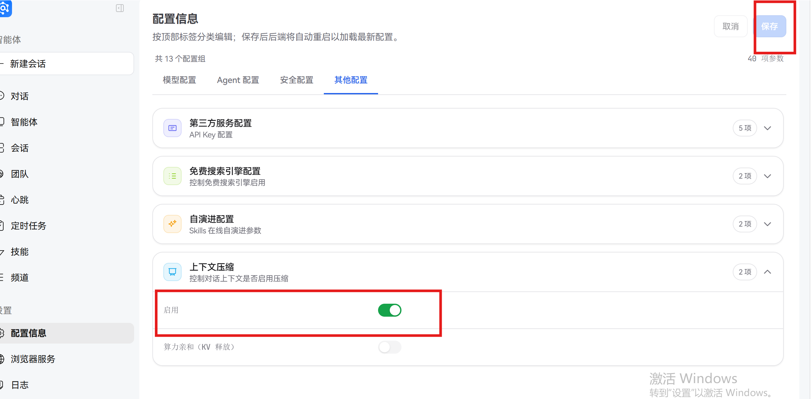
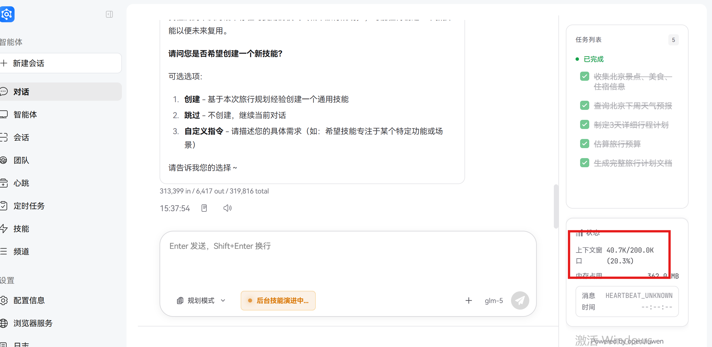
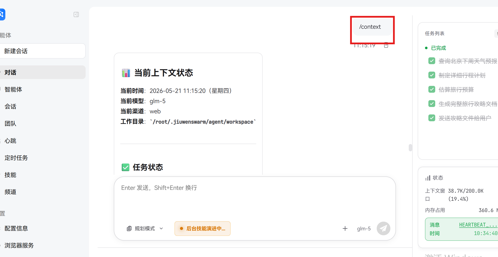
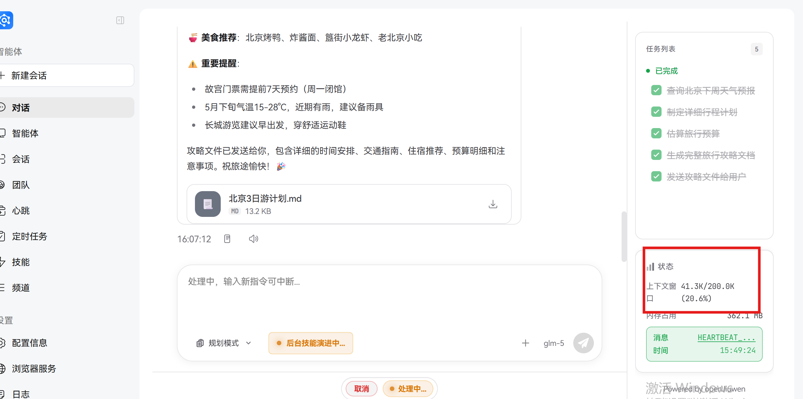

# 上下文压缩

## 1. 概念科普

### 1.1 上下文的概念

在 AI 对话系统中，**上下文**指的是对话过程中产生的所有历史信息，包括用户的提问、AI 的回答、工具调用的结果等。这些信息共同构成了 AI 理解当前对话状态和提供准确回答的基础。

### 1.2 上下文窗口限制

尽管上下文对于 AI 理解对话至关重要，但所有 AI 模型都存在**上下文窗口限制**——即模型在单轮对话中能够处理的最大信息量（通常以 Token 数量衡量）。当对话超出这个限制时，AI 会出现以下问题：

- 响应速度显著变慢
- 早期关键信息被遗忘
- 回答准确性下降
- 系统资源消耗过大

### 1.3 上下文压缩的概念

**上下文压缩**是一种智能优化技术，通过对历史对话内容进行分析、筛选和精简，在保持对话连贯性的前提下，将上下文信息压缩到模型可处理的范围内。

其核心思想可以类比为：在阅读一本长篇小说时，我们不需要记住每一个细节，只需要记住关键情节和人物关系，就能理解故事的发展。

JiuwenSwarm 可以通过上下文压缩卸载机制，使用 `[[OFFLOAD:...]]` 格式的索引标记大工具消息的卸载内容，在显著减少上下文数据量的同时，保留大工具消息的检索能力。

> **注意**：普通压缩后的内容无法召回，只有被卸载的大工具消息内容可以通过 `[[OFFLOAD:...]]` 索引标记进行检索。

### 1.4 应用场景

上下文压缩技术适用于各种需要长时间对话的场景：

- **数据分析**：处理大量数据表格和分析结果
- **项目管理**：跨多天的项目跟进和讨论
- **代码开发**：长时间的代码编写和调试
- **文档创作**：长篇文档的协作编写
- **客户支持**：复杂问题的长时间解决过程

## 2. 基础使用

### 2.1 开启上下文压缩

上下文压缩功能默认是关闭的，您可以通过以下方式开启：

**方式一：通过配置文件开启**

编辑 `config.yaml` 配置文件，找到 `context_engine_config` 部分：

```yaml
    enabled: true         # 将此设置为 true 开启上下文压缩
```

**方式二：通过前端界面开启**

在 JiuwenSwarm 客户端中，进入页面：



- 点击左侧菜单栏的"配置信息"
- 选择"其他配置"
- 找到"上下文压缩"
- 点击开关将其开启

### 2.2 查看上下文压缩状态

开启上下文压缩后，您可以通过以下方式查看压缩状态：

**方式一：查看对话状态面板**

在对话界面的右下角，系统会实时显示上下文窗口的使用情况：



状态面板包含以下信息：

- 当前使用的 Token 数
- 模型支持的最大 Token 数
- 当前占用比例

**方式二：通过 Slash 命令查看**

在对话输入框中输入以下命令可以查看详细的上下文压缩信息：

```bash
/context
```



## 3. 案例实践

为便于演示上下文压缩效果，本案例将触发阈值调整为 40K（默认值为 100K）。当上下文长度达到 40K 时，系统自动触发压缩机制，可在较短对话中观察压缩过程。

开发者可根据接入模型和业务需求，通过修改 `config.yaml` 中各处理器的 `tokens_threshold` 参数自定义阈值。

开发者可根据接入模型和业务需求，通过修改 `config.yaml` 中各处理器的 `tokens_threshold` 参数自定义阈值。

### 3.1 无上下文压缩的情况

**场景**：用户与 AI 咨询北京3天旅行计划（单一请求）

**对话过程**：

```
User: 帮我规划一个下周去北京的3天旅行计划
Assistant: 好的，我来为您规划一个详细的北京3天旅行计划。
Tool: 正在查询北京天气和景点信息...
Tool Response: 返回了详细的天气数据和景点推荐
Assistant: 根据您的需求，我为您制定了以下旅行计划：

【北京3天深度游行程】

Day 1: 天安门广场 → 故宫 → 景山公园
- 上午：天安门广场看升旗
- 中午：故宫游览
- 下午：景山公园俯瞰故宫全景

Day 2: 八达岭长城 → 明十三陵
- 上午：八达岭长城
- 下午：明十三陵

Day 3: 颐和园 → 圆明园 → 南锣鼓巷
- 上午：颐和园
- 中午：圆明园
- 下午：南锣鼓巷感受老北京文化

美食推荐：北京烤鸭、炸酱面、涮羊肉

重要提醒：请提前预约故宫门票
```

**说明**：

- 图片中可看到：AI回复内容包含丰富的旅行信息
- 图片右下角状态面板显示：上下文窗口 41.3K/289.0K (20.6%)
- Token消耗主要来自：AI的详细回复内容 + 工具调用返回的数据

**最终结果**：

- 整个对话的上下文 Token 数已达到 41.3K，占用模型窗口的 20.6%
- 后续对话风险：如果用户继续追问细节或请求扩展计划，上下文会继续增长
- 潜在问题：随着对话深入，可能接近模型上下文窗口上限



### 3.2 有上下文压缩的情况

**相同场景**：用户与 AI 咨询北京3天旅行计划（单一请求）

**相同任务**：获得详细且可用的北京3天旅行计划

**对话过程**：

```
User: 帮我规划一个下周去北京的3天旅行计划
Assistant: 好的，我来为您规划一个详细的北京3天旅行计划。
Tool: 正在查询北京天气和景点信息...
Tool Response: 返回了详细的天气数据和景点推荐
Assistant: 根据您的需求，我为您制定了以下旅行计划：

【北京3天深度游行程】

Day 1: 天安门广场 → 故宫 → 景山公园
...（系统自动压缩了详细行程内容）

[[OFFLOAD: 旅行计划详情已压缩，核心信息保留]]
```

**说明**：

- 图片中可看到：AI完成了完整的旅行计划任务
- 图片右下角状态面板显示：上下文窗口 40.7K/289.0K (28.3%)

**最终结果**：

- 整个对话的上下文 Token 数保持在 40.7K，占用模型窗口的 28.3%
- AI 保持核心信息记忆：能够处理后续的进一步请求
- 系统能够完成更多关联任务：如创建技能等扩展功能
- 用户体验优化：可以继续进行多轮交互和功能扩展


### 3.3 实际效果说明

从两张示例图片的实际数据来看（基于40k阈值测试）：

1. **上下文 Token 使用**：
   - 无压缩场景：41.3K Token
   - 有压缩场景：40.7K Token
   - 两者差异不大，说明在单次详细请求场景下，压缩主要优化的是信息结构而非简单减少Token数量
2. **系统功能表现**：
   - 两种场景均成功完成了旅行计划生成
   - 有压缩场景额外支持了技能创建等扩展功能
   - 内存占用稳定在362MB左右，系统资源消耗差异不明显
3. **实际价值体现**：
   - 上下文压缩通过优化信息结构，使系统能够更好地处理后续扩展请求
   - 保持核心信息完整性的同时，提升了系统的功能扩展性
4. **阈值说明**：
   - 当前示例基于40k Token触发阈值测试，便于快速观察压缩效果
   - 生产环境中可根据实际需求调整阈值参数（如100k及以上）

## 4. 特性解读

### 4.1 动态触发机制

上下文压缩不是固定的预处理步骤，而是根据对话状态动态触发的智能优化：

- **基于消息数量**：当对话轮次超过 `messages_threshold` 时触发（不同处理器有不同默认值）
- **基于 Token 数量**：当累计 Token 数超过 `tokens_threshold` 时触发（不同处理器有不同默认值）
- **基于轮次级别**：当对话轮次超过 `rounds_threshold` 时触发高级压缩
- **可配置性**：用户可以根据需要调整各个触发阈值

### 4.2 智能识别和压缩

系统采用先进的自然语言处理技术，能够：

- **区分消息类型**：自动识别用户消息、AI 回答和工具结果
- **识别重要性**：基于语义分析判断消息的重要程度
- **选择压缩方式**：对不同类型的内容采用不同的压缩策略
  - 对工具返回的冗长数据进行摘要
  - 对重复信息进行合并
  - 对不重要的内容进行过滤

### 4.3 关键信息保护

上下文压缩不会丢失重要信息，系统会：

- **保留最近消息**：通过 `messages_to_keep` 参数保留指定数量的最新消息
- **保留完整轮次**：启用 `keep_last_round` 确保最新一轮的用户-助手对话完整保留
- **识别关键内容**：通过语义分析自动识别并保留关键信息

### 4.4 检索能力保持

上下文压缩不会破坏对话的检索能力：

- **卸载标记**：部分处理器使用 `[[OFFLOAD:...]]` 格式标记被卸载的内容，便于未来按需加载
- **关联保留**：压缩后的信息仍然与原始上下文保持关联
- **按需加载**：在需要时可以通过卸载标记按需加载原始信息

### 4.5 性能优化

上下文压缩能够显著提升系统性能：

- **减少内存占用**：将上下文数据量减少 50%-80%
- **提高响应速度**：降低模型推理时间，提升用户体验
- **支持更长对话**：突破模型上下文窗口限制，支持长时间对话
- **降低成本**：减少 Token 消耗，降低使用成本

## 5. 进阶配置

JiuwenSwarm 的上下文压缩系统包含 **4 个独立的处理器**，每个都有自己的配置参数。以下是与代码完全一致的完整配置示例：

```yaml
context_engine_config:
  # 全局开关
  enabled: true                    # 启用上下文压缩（核心开关）
  enable_kv_cache_release: false   # 启用 KV 缓存释放（算力优化）
  enable_reload: true              # 启用重新加载

  # 1. 消息摘要卸载器 - 处理工具调用等特定类型消息
  message_summary_offloader_config:
    messages_threshold: null       # 消息数阈值（null 表示不限制）
    tokens_threshold: 60000        # Token 数触发阈值
    large_message_threshold: 60000 # 大消息定义（超过此值视为大消息）
    offload_message_type: [ "tool" ] # 要压缩的消息类型（列表形式）
    protected_tool_names: ["read_file:*SKILL.md", "reload_original_context_messages"]
    messages_to_keep: null         # 保留的消息数
    keep_last_round: false         # 是否保留最后一轮对话
    customized_summary_prompt: null # 自定义摘要提示词
    enable_adaptive_compression: true # 启用自适应压缩
    summary_max_tokens: 900        # 摘要最大 Token 数
    enable_precise_step: false     # 启用精确步骤模式
    step_summary_max_context_messages: 8 # 精确步骤模式下最大上下文消息数
    content_max_chars_for_compression: 200000 # 压缩内容最大字符数

  # 2. 对话压缩器 - 压缩整个对话历史
  dialogue_compressor_config:
    messages_threshold: null       # 消息数阈值
    tokens_threshold: 100000       # Token 数触发阈值
    messages_to_keep: 10           # 保留最近 10 条消息
    keep_last_round: false         # 是否保留最后一轮
    compression_target_tokens: 1800 # 压缩目标 Token 数
    offload_writeback_enabled: false # 是否启用卸载写回

  # 3. 当前轮次压缩器 - 压缩当前对话轮次
  current_round_compressor_config:
    tokens_threshold: 100000        # Token 数触发阈值
    messages_to_keep: 3             # 保留最近 3 条消息
    min_selected_tokens_for_compression: 20000 # 压缩最小 Token 数
    compression_target_tokens: 4000 # 压缩目标 Token 数
    summary_merge_target_tokens: 4000 # 摘要合并目标 Token 数
    accumulated_summary_token_limit: 20000 # 累积摘要 Token 限制
    summary_merge_min_blocks: 3     # 摘要合并最小块数
    prior_context_window_size: 10   # 先前上下文窗口大小
    offload_writeback_enabled: false # 是否启用卸载写回

  # 4. 轮次级别压缩器 - 多轮对话高级压缩
  round_level_compressor_config:
    rounds_threshold: 2            # 轮次阈值（超过此轮次触发）
    tokens_threshold: 230000       # Token 数触发阈值
    trigger_total_tokens: 230000   # 触发总 Token 数
    target_total_tokens: 160000    # 目标总 Token 数
    compression_call_max_tokens: 250000 # 压缩调用最大 Token 数
    keep_last_round: true          # 保留最后一轮对话
    keep_recent_messages: 6        # 保留最近 6 条消息
    messages_to_keep: 6            # 保留消息数
    first_pass_target_tokens: 30000 # 第一轮压缩目标 Token 数
    second_pass_target_tokens: 20000 # 第二轮压缩目标 Token 数
    third_pass_target_tokens: 10000 # 第三轮压缩目标 Token 数
    truncate_head_ratio: 0.2       # 头部截断比例
    offload_writeback_enabled: false # 是否启用卸载写回
```

### 5.1 配置参数说明

#### 消息摘要卸载器（message_summary_offloader_config）

| 参数 | 说明 | 默认值 |
|------|------|--------|
| `tokens_threshold` | 触发压缩的 Token 阈值 | 60000 |
| `offload_message_type` | 要压缩的消息类型，支持 `["tool"]` | `["tool"]` |
| `enable_adaptive_compression` | 是否启用自适应压缩 | true |
| `summary_max_tokens` | 摘要最大 Token 数 | 900 |

#### 对话压缩器（dialogue_compressor_config）

| 参数 | 说明 | 默认值 |
|------|------|--------|
| `tokens_threshold` | 触发压缩的 Token 阈值 | 100000 |
| `messages_to_keep` | 保留的消息数 | 10 |
| `compression_target_tokens` | 压缩后的目标 Token 数 | 1800 |

#### 当前轮次压缩器（current_round_compressor_config）

| 参数 | 说明 | 默认值 |
|------|------|--------|
| `min_selected_tokens_for_compression` | 触发压缩的最小 Token 数 | 20000 |
| `summary_merge_target_tokens` | 摘要合并后的目标 Token 数 | 4000 |
| `prior_context_window_size` | 先前上下文窗口大小 | 10 |

#### 轮次级别压缩器（round_level_compressor_config）

| 参数 | 说明 | 默认值 |
|------|------|--------|
| `rounds_threshold` | 触发压缩的对话轮次阈值 | 2 |
| `trigger_total_tokens` | 触发压缩的总 Token 数 | 230000 |
| `first_pass_target_tokens` | 第一轮压缩目标 | 30000 |
| `second_pass_target_tokens` | 第二轮压缩目标 | 20000 |
| `third_pass_target_tokens` | 第三轮压缩目标 | 10000 |
| `truncate_head_ratio` | 头部截断比例 | 0.2 |

### 5.2 配置层级说明

配置文件中的完整层级结构如下：

```yaml
react:                              # 顶层 React 配置
  context_engine_config:            # 上下文引擎配置
    enabled: true                   # 全局开关
    message_summary_offloader_config: {}  # 处理器 1
    dialogue_compressor_config: {}       # 处理器 2
    current_round_compressor_config: {}  # 处理器 3
    round_level_compressor_config: {}    # 处理器 4
```

### 5.3 配置注意事项

1. **处理器独立工作**：4 个处理器各自独立触发，互不依赖
2. **阈值配置**：建议根据实际业务场景调整 `tokens_threshold` 参数
3. **类型要求**：`offload_message_type` 必须是列表形式 `["tool"]`，不能是字符串 `"tool"`
4. **多级压缩**：`round_level_compressor_config` 提供三轮渐进式压缩，适合长对话场景

通过合理配置这些参数，用户可以根据自己的使用场景和需求，获得最佳的上下文压缩效果和对话体验。
