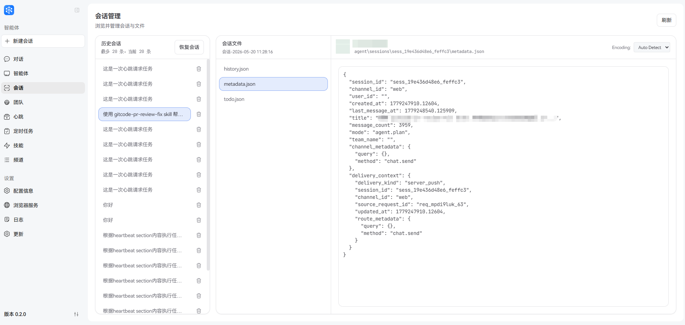
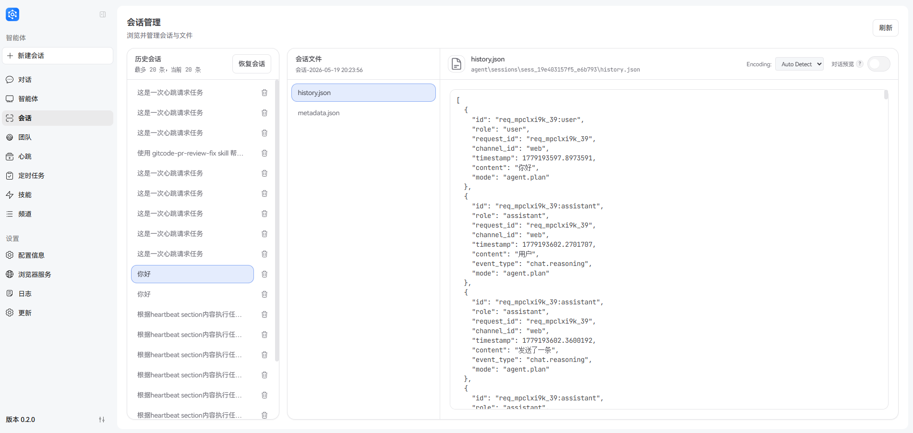
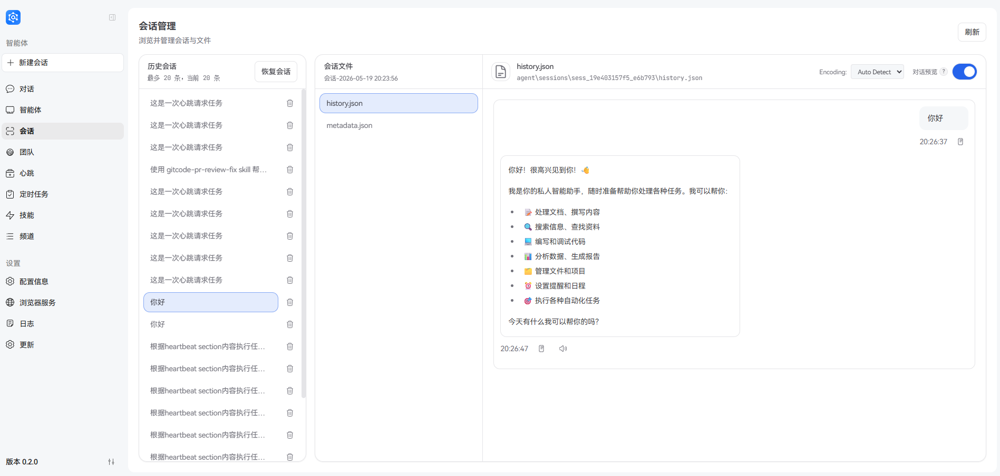
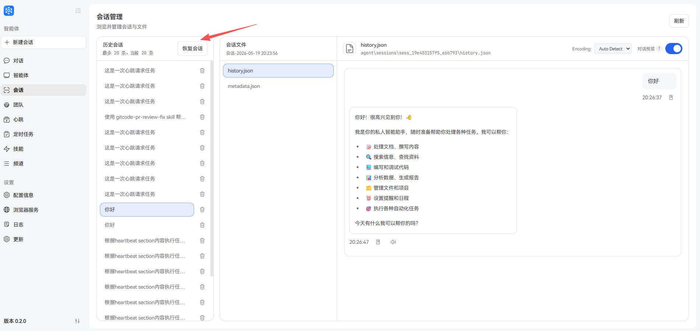
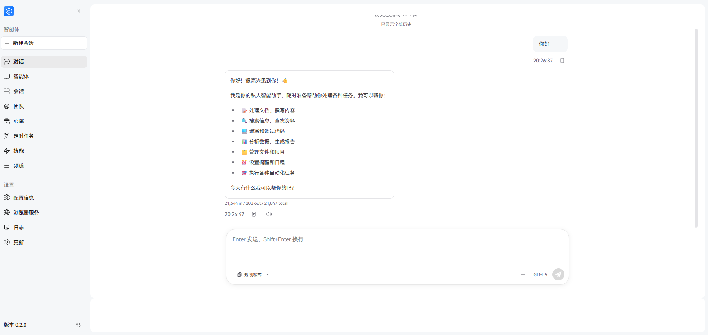
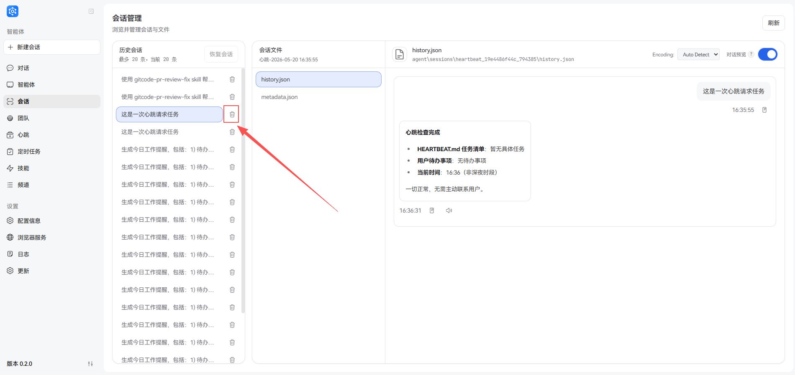

# 会话

会话（Session）是 JiuwenSwarm 中管理对话历史和上下文的核心机制。

---

## 概念科普

### 什么是会话

**会话（Session）** 是 JiuwenSwarm 用于记录和管理单次或多次连续对话交互的数据单元。每个会话包含：

- **对话历史**：用户与 AI 之间的完整消息往来
- **上下文信息**：当前任务状态、执行进度、中间结果等
- **元数据**：会话 ID、创建时间、最后更新时间等标识信息

> **提示**：会话与记忆（Memory）是两个不同的概念：
> - **会话**：临时性的对话历史，关闭或清空后即消失
> - **记忆**：持久化存储的重要信息，跨会话保留

### 会话文件结构

JiuwenSwarm 的会话数据存储在本地工作空间中，典型的会话文件结构如下：

```
.jiuwenswarm/
└── agent/
    └── sessions/
        ├── sess_19ddd41cbc0_fd1e4d/    # 普通会话目录
        │   ├── metadata.json          # 会话元数据
        │   └── history.json           # 对话历史记录
        ├── sess_19ddd5cc729_09bb02/   # 另一个会话
        │   ├── metadata.json
        │   └── history.json
        ├── heartbeat_19de6f526fb_224694/  # 心跳会话目录
        │   ├── metadata.json
        │   └── history.json
        └── ...
```

**会话类型说明：**

| 目录前缀 | 类型 | 说明 |
|----------|------|------|
| `sess_` | 普通会话 | 用户通过 Web、飞书等渠道发起的对话会话 |
| `heartbeat_` | 心跳会话 | 系统定时执行的心跳任务会话 |
| `cron_` | 定时任务会话 | 定时任务触发的会话（`metadata.json` 中 `cron_id` 非空） |

**会话类型区分：**

- **普通会话**：`cron_id` 为空串，通过 `project.get_sessions` 获取
- **定时任务会话**：`cron_id` 非空（值为对应 `CronJob.id`），通过 `project.get_cron_sessions` 获取，支持按 `cron_id` 过滤某任务的全部历史执行
- 两种会话在项目视图下互斥分工，`project.list` 的 `session_count` 仅统计普通会话

**metadata.json 文件内容说明：**



| 字段 | 说明 | 示例 |
|------|------|------|
| `session_id` | 会话唯一标识符 | `sess_19ddd41cbc0_fd1e4d` |
| `channel_id` | 会话来源渠道 | `web`、`feishu`、`__heartbeat__` |
| `user_id` | 用户标识 | 空或用户 ID |
| `created_at` | 会话创建时间（Unix 时间戳） | `1716249600.732591` |
| `last_message_at` | 最后一条消息时间 | `1716253200.865117` |
| `title` | 会话标题（通常为首条消息摘要） | `帮我写一份技术文档` |
| `message_count` | 消息总数 | `15` |
| `mode` | 执行模式 | `agent.plan` |
| `project_id` | 归属项目 ID | `proj_abc123`（空串表示默认项目） |
| `cron_id` | 来源定时任务 ID | 空串为普通会话，非空为 cron 会话 |

**history.json 文件内容说明：**

history.json 是一个 JSON 数组，记录了完整的对话历史。每条消息包含以下字段：



| 字段 | 说明 | 示例 |
|------|------|------|
| `id` | 消息唯一标识，后缀为 `user` 表示用户 query 信息，后缀为 `assistant` 表示 agent 答复信息 | `req_mol5noj7_22:user` |
| `role` | 消息角色 | `user` 或 `assistant` |
| `request_id` | 请求标识 | `req_mol5noj7_22` |
| `channel_id` | 消息来源渠道 | `web` |
| `timestamp` | 消息时间戳 | `1777533730.7309785` |
| `content` | 消息内容 | 用户输入或 AI 回复文本 |
| `event_type` | 事件类型 | `chat.delta`、`chat.final`、`chat.reasoning` |
| `tool_calls` | 工具调用信息（仅 assistant 消息） | 包含工具名称、参数等 |

> **提示**：agent 答复消息中还会包含 `tool_calls` 等字段，用于记录工具调用信息。

### 为什么需要会话

会话机制在 JiuwenSwarm 中扮演着重要角色，主要原因包括：

1. **上下文连续性**
   - 保持对话的连贯性，AI 能够理解之前的交流内容
   - 支持多轮对话中的信息引用和补充

2. **任务状态追踪**
   - 记录任务规划、执行进度和中间结果
   - 支持任务的中断、恢复和调整

3. **历史回溯**
   - 用户可以查看之前的对话记录
   - 便于复盘和追溯问题解决过程

4. **资源管理**
   - 合理管理对话上下文，避免信息过载
   - 支持上下文压缩机制，优化 token 使用

### 会话使用场景

| 场景 | 说明 |
|------|------|
| **日常对话** | 与 AI 进行问答、咨询、内容创作等交互 |
| **任务执行** | 下达复杂任务，跟踪执行进度，调整任务计划 |
| **历史回顾** | 查看之前的对话内容，恢复中断的工作 |
| **问题排查** | 通过会话记录追溯问题，分析执行过程 |
| **多任务切换** | 在不同会话间切换，处理多个独立任务 |
| **定时任务执行** | 定时任务自动触发会话，执行周期性工作 |
| **多渠道对话** | 来自不同渠道的对话（Web、飞书、微信等） |

---

## 功能演示

### 查看会话聊天记录

您可以查看所有会话的完整聊天记录，了解历史对话内容。



**操作步骤：**

1. **通过前端界面查看**
   - 在 JiuwenSwarm Web 界面左侧导航栏，点击「会话」菜单
   - 进入会话管理页面，可以看到所有会话列表（即前端会话管理中呈现的列表）
   - 点击任意会话，即可查看该会话的完整聊天记录

2. **通过本地文件查看**
   - 导航到会话存储目录：`.jiuwenswarm/agent/sessions/`
   - 进入对应会话目录（如 `sess_19ddd41cbc0_fd1e4d/`）
   - 查看 `history.json` 文件中的对话内容

> **提示**：前端页面有一个「对话预览」开关，可以切换显示 JSON 文本格式或对话页面格式，方便查看原始数据或对话内容。

### 恢复会话

恢复会话可以将历史会话内容同步到前端，继续之前的工作。



上图展示了会话管理页面中可恢复的历史会话列表。



上图展示了恢复会话后的对话页面，可以看到完整的历史对话内容。

**操作步骤：**

1. 在会话管理页面，找到需要恢复的会话（建议选择一个实际聊天的历史会话，而不是心跳会话）
2. 点击「恢复」按钮或双击会话条目
3. 系统将加载该会话的所有历史消息
4. 恢复后，您可以在对话页面看到完整的对话历史
5. 继续输入新内容，AI 将基于历史上下文进行回复

**使用场景：**

| 场景 | 说明 |
|------|------|
| **中断恢复** | 之前的工作被中断，需要继续完成 |
| **任务延续** | 复杂任务分多次完成，每次从上次进度继续 |
| **内容补充** | 对之前的结果不满意，需要补充要求或调整 |

**注意事项：**

- 恢复会话后，新消息将追加到原有对话历史中
- 如果会话包含未完成的任务，系统会尝试恢复任务状态
- 长时间未活动的会话可能已被压缩，恢复时需要解压


### 删除历史会话

如果某个会话不再需要，您可以直接在会话管理页面删除该会话，释放存储空间并保持列表整洁。



**操作步骤：**

1. 在 JiuwenSwarm Web 界面左侧导航栏，点击「会话」菜单
2. 在会话管理页面选择要删除的会话
3. 在右侧会话详情区域，点击“删除”图标
4. 弹出确认对话框后，点击“确认”按钮
5. 删除成功后，该会话将从列表中移除

> **提示**：请确认选择的是不再需要的历史会话。已删除的会话可能无法恢复。


---

## 常见问题

### Q1: 会话和记忆有什么区别？

**会话**是临时的对话历史，存储当前对话过程中的所有消息，清空或关闭后即消失。**记忆**是持久化存储的重要信息，如用户偏好、关键知识点等，跨会话保留。

### Q2: 会话数据会占用多少存储空间？

会话数据通常较小，每条消息约几 KB。但如果包含大量文件上传或长对话，单个会话可能达到数 MB。建议定期清理不需要的历史会话。

### Q3: 恢复会话后，之前的任务状态会保留吗？

是的，恢复会话时，系统会尝试恢复之前的任务状态，包括任务列表、执行进度等。但部分正在执行的任务可能需要重新触发。

### Q4: 会话数据存储在哪里？

会话数据存储在本地工作空间的 `.jiuwenswarm/agent/sessions/` 目录下，每个会话是一个独立的目录，包含 `metadata.json` 和 `history.json` 两个文件。

### Q5: 如何备份重要会话？

您可以：
1. 直接复制会话 JSON 文件到其他位置
2. 导出会话内容为 Markdown 或文本格式
3. 将重要信息写入记忆，实现跨会话保留

---

## 相关链接

- [快速上手教程](Quickstart.md) - 了解 JiuwenSwarm 基本使用
- [记忆系统](记忆.md) - 了解持久化记忆机制
- [任务规划](任务规划.md) - 了解任务管理机制
- [页面概览](页面概览.md) - 了解界面布局
- [对话教程](智能体.md) - 了解对话功能

---

*文档版本：v1.0*  
*适用对象：JiuwenSwarm  用户*  
*最后更新：2026-05-05*
