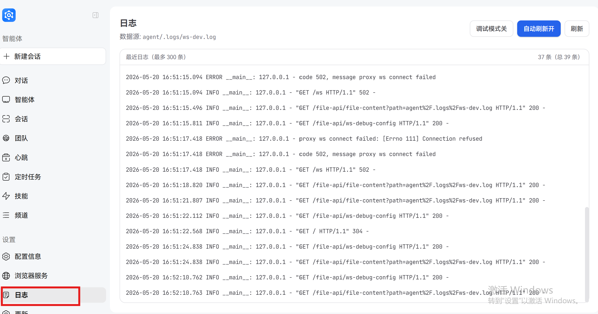

# 日志

JiuwenSwarm 提供了完善的日志系统，用于记录系统运行状态、调试信息和审计日志，帮助用户监控系统运行、排查问题和分析系统行为。

## 1. 日志基础

### 1.1 存储位置

默认情况下，JiuwenSwarm 的日志文件存储在以下位置：

```
~/.jiuwenswarm/agent/.logs/
```

### 1.2 日志文件分类

日志系统根据组件类型将日志分类存储到不同文件中：

| 日志文件 | 记录内容 |
|---------|---------|
| `gateway.log` | 网关相关日志，包括 `app`、`gateway`、`evolution`、`utils` 等模块 |
| `channel.log` | 渠道相关日志，包括所有 `channels` 下的模块 |
| `agent_server.log` | 智能体服务器日志，包括 `agents` 和 `.server` 下的模块 |
| `full.log` | 所有组件日志的汇总 |
| `desktop.log` | 桌面应用日志 |
| `permissions.log` | 权限相关日志 |
| `ws-dev.log` | Web 服务开发模式日志 |

### 1.3 日志内容类型

日志系统根据内容类型分为两种主要类型：

#### 1.3.1 普通日志

普通日志按组件分类，记录系统运行状态、错误信息、调试信息等：
- 使用标准的 Python logging 模块实现
- 根据组件类型存储到不同文件中（见1.2节）

#### 1.3.2 审计日志

审计日志以结构化 JSONL 格式记录沙箱操作详情，包括：
- 命令执行（`exec_command`）
- 文件传输（`file_transfer`）
- 网络请求（`network_request`）

每条审计日志包含操作类型、参数、结果、执行时间等信息。

## 2. 查看日志

### 2.1 前端查看日志



### 2.2 实时查看日志

使用 `tail` 命令实时查看日志：

```bash
# 实时查看 full.log
$ tail -f ~/.jiuwenswarm/agent/.logs/full.log

# 实时查看特定组件日志
$ tail -f ~/.jiuwenswarm/agent/.logs/gateway.log
```

### 2.3 查看历史日志

使用 `cat` 查看日志

```bash
# 查看完整日志文件
$ cat ~/.jiuwenswarm/agent/.logs/full.log
```

## 3. 日志轮转策略

日志系统采用以下轮转策略：

- **大小限制**：默认每个日志文件最大 20MB（可通过 `max_bytes` 配置）
- **保留数量**：默认保留 20 个日志文件（可通过 `backup_count` 配置）
- **自动轮转**：当日志文件达到大小限制时，自动创建新文件并归档旧文件
- **命名格式**：归档文件命名为 `{filename}.{index}`，例如 `gateway.log.1`

## 4. 日志系统架构

### 4.1 核心模块

- **日志配置**：`jiuwenclaw/common/utils.py` 中的 `setup_logger` 函数
- **审计日志**：`jiuwenbox/src/jiuwenbox/server/audit_logger.py`
- **默认日志实现**：`openjiuwen/core/common/logging/default/default_impl.py`

### 4.2 日志流程

1. 各模块通过 `logging.getLogger(__name__)` 获取 logger
2. 根据 logger 名称自动分类到不同组件
3. 日志同时输出到控制台和对应组件的日志文件
4. 所有日志汇总到 `full.log`
5. 当日志文件达到大小限制时自动轮转

## 5. 日志配置

### 5.1 配置文件

日志级别主要通过 `config.yaml` 文件中的 `logging` 部分配置：

```yaml
logging:
  level: INFO            # 默认日志级别
  console_level: INFO    # 控制台日志级别
  gateway: INFO          # 网关组件日志级别
  channel: INFO          # 渠道组件日志级别
  agent_server: INFO     # 智能体服务器日志级别
  full: INFO             # 完整日志级别
  max_bytes: 20971520    # 日志文件大小限制（20MB）
  backup_count: 20       # 保留日志文件数量
```

### 5.2 环境变量

可以通过环境变量覆盖控制台日志级别：

```bash
LOG_LEVEL=DEBUG jiuwenswarm-start
```

### 5.3 命令行参数

启动服务时，可以通过参数指定日志级别：

```bash
jiuwenswarm-start --log-level DEBUG
```

## 6. 日志级别

JiuwenSwarm 支持标准的 Python 日志级别：

| 级别 | 描述 |
|------|------|
| DEBUG | 调试信息，用于开发和调试 |
| INFO | 一般信息，记录系统正常运行状态 |
| WARNING | 警告信息，记录潜在问题 |
| ERROR | 错误信息，记录系统错误 |
| CRITICAL | 严重错误信息，记录系统崩溃等严重问题 |

## 7. 日志格式

日志格式包含时间戳、日志级别、模块名和日志消息：

```
2026-05-19 15:30:45.123 INFO jiuwenclaw.app: Service started successfully
```

### 7.1 审计日志格式

审计日志使用结构化 JSON 格式：

```json
{
  "timestamp": "2026-05-19T15:30:45.123Z",
  "event_type": "exec_command",
  "sandbox_id": "9284a4bf-870",
  "command": "ls -la",
  "workdir": "/home/user",
  "ok": true,
  "exit_code": 0,
  "stdout": "total 40\ndrwxr-xr-x  5 user user 4096 May 19 15:30 .",
  "stderr": "",
  "duration_ms": 123
}
```

## 8. 常见问题与排查

### 8.1 日志文件过大

**问题**：日志文件增长过快，占用过多磁盘空间

**解决方案**：
- 降低日志级别以减少日志输出
- 减小 `max_bytes` 配置以减小单个日志文件大小
- 减小 `backup_count` 配置以减少保留的日志文件数量

### 8.2 无日志输出

**问题**：找不到日志文件或日志内容为空

**解决方案**：
- 检查日志目录权限是否正确
- 检查日志级别配置是否过高
- 检查服务是否正常启动

### 8.3 日志乱码

**问题**：日志文件包含乱码字符

**解决方案**：
- 确保系统编码设置正确（推荐使用 UTF-8）
- 使用支持 UTF-8 编码的文本编辑器查看日志

## 9. 最佳实践

1. **开发环境**：使用 DEBUG 级别获取详细调试信息
2. **生产环境**：使用 INFO 或 WARNING 级别减少日志输出
3. **定期清理**：定期清理过期日志文件，避免占用过多磁盘空间
4. **集中管理**：考虑使用日志收集工具（如 ELK Stack）进行日志集中管理
5. **敏感信息**：注意日志中可能包含的敏感信息，如 API 密钥、密码等

## 10. 相关配置文件

- 主配置文件：`~/.jiuwenswarm/config/config.yaml`
- 环境变量文件：`~/.jiuwenswarm/config/.env`
- 日志系统实现：`jiuwenclaw/common/utils.py`
- 审计日志实现：`jiuwenbox/src/jiuwenbox/server/audit_logger.py`