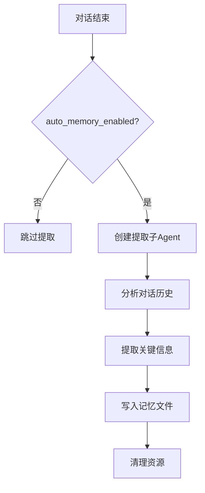

# 自动记忆（Auto Memory）

自动记忆是 JiuwenSwarm 的对话后记忆提取功能，在每次对话结束后自动分析对话内容，提取值得长期保留的信息并写入记忆文件，按项目隔离存储。

---

## 功能概述

- **自动提取**：对话结束后无需用户干预，系统自动分析并提取关键信息
- **项目隔离**：每个项目独立存储记忆，避免跨项目信息混淆
- **可配置开关**：通过配置文件或 TUI 命令灵活启用/禁用

---

## 启用方式

### 配置文件启用

配置键按模式区分：

- **agent 模式**：全局 `auto_memory_enabled`（`config.yaml` 顶层）；
- **code 模式**：`modes.code.memory.auto_coding_memory`（在 `modes.code.memory` 段下）。

```yaml
# agent 模式 — 全局开关
auto_memory_enabled: true

# code 模式 — 按模式开关，位于 modes.code.memory 下
modes:
  code:
    memory:
      auto_coding_memory: true
```

### TUI 命令启用

在 TUI 终端中使用 `/memory` 命令打开页签控制台：

```
/memory          # 打开记忆管理页签控制台（默认 edit 页签）
/memory toggle   # 打开页签控制台并选中 toggle 页签
```

页签控制台提供 4 个页签：edit / status / toggle / open，默认选中 edit 页签。使用 ←/→ 切换页签，↑/↓ 在列表中移动，Enter 执行，Ctrl+O 切换全路径（edit/open 页签，切换页签时重置为默认相对路径），Esc 关闭。

---

## 存储路径

自动记忆按项目路径隔离存储：

```
~/.jiuwenswarm/projects/{sanitized-project-path}/memory/
├── MEMORY.md                    # 长期记忆
├── YYYY-MM-DD.md                # 每日记忆
└── consolidated_{hash}.md       # 整合记忆（可选）
```

其中 `{sanitized-project-path}` 是项目路径经过安全处理后的字符串（替换特殊字符为下划线）。

---

## 工作机制

### 提取时机

自动记忆在以下时机触发：

1. **对话结束时**：每次用户与 Agent 的对话结束后，系统检查是否需要提取记忆
2. **非流式请求**：`process_message` 返回结果后触发
3. **流式请求**：`process_message_stream` 完成后触发

### 提取内容

系统通过子 Agent 分析对话内容，提取以下类型的信息：

| 信息类型 | 说明 | 示例 |
|----------|------|------|
| 用户偏好 | 用户明确表达的偏好或习惯 | "用户偏好使用 pytest 框架" |
| 项目决策 | 技术选型、架构决策 | "项目采用 FastAPI 作为后端框架" |
| 关键事实 | 需要长期记住的事实 | "数据库连接字符串存储在 .env 文件" |
| 问题解决 | 调试过程、问题根因 | "登录失败原因是 JWT 过期时间配置错误" |

### 提取流程



---

## 配置说明

| 配置项 | 说明 | 默认值 |
|--------|------|--------|
| `auto_memory_enabled` | 自动记忆提取开关（agent 模式，顶层） | `false` |
| `modes.code.memory.auto_coding_memory` | 自动编码记忆提取开关（code 模式） | `false` |

---

## TUI 交互

### `/memory` 命令

在 TUI 中输入 `/memory` 命令，会打开记忆管理页签控制台（默认选中 edit 页签）：

```
Memory
[edit] [status] [toggle] [open]
  ↑
  使用 ←/→ 切换页签，↑/↓ 列表移动，Enter 执行，Ctrl+O 切换全路径（切换页签时重置为默认相对路径），Esc 关闭

--- toggle 页签 ---
只显示 key（不显示英文 label），有 ✓ on / ✗ off 状态标记和中文描述，无 · 分隔符。
按模式自适应显示开关：

agent mode:
  memory_enabled            ✓ on   记忆功能总开关
  memory_proactive          ✓ on   对话中自动搜索和记录
  memory_forbidden_enabled  ✗ off  过滤敏感信息

code mode:
  memory_enabled            ✓ on   记忆功能总开关
  auto_coding_memory        ✓ on   每轮对话后自动提取记忆（需总开关开启）
  memory_forbidden_enabled  ✗ off  过滤敏感信息
```

toggle 页签中的开关按当前模式（agent mode / code mode）自适应显示，切换对应开关即可启用/禁用相应记忆功能。

Tab 补全：`/memory edit ` 后显示文件列表（路径用 `getDisplayPath` 展示，去重）；`/memory toggle ` 后显示当前 mode 的 key 列表；均支持前缀过滤。

---

## 注意事项

1. **首次启用**：首次启用自动记忆后，需要重启会话才能生效
2. **存储空间**：长期使用会积累记忆文件，建议定期清理过期内容
3. **敏感信息**：系统会自动过滤密码、API Key 等敏感信息（通过 `memory.forbidden_memory_definition` 配置）
4. **性能影响**：提取过程在后台异步执行，不影响对话响应速度

---

## 详见

- [配置信息](配置信息.md) — 配置文件详细说明
- [TUI 使用指南](TUI使用指南.md) — TUI 命令使用方法